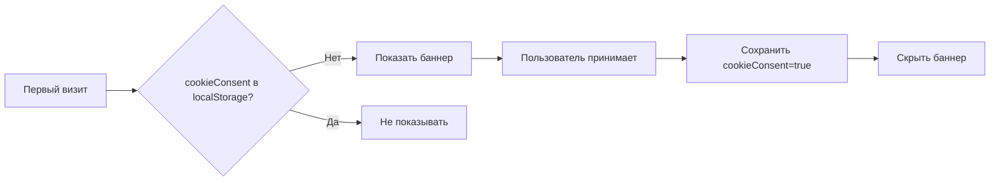
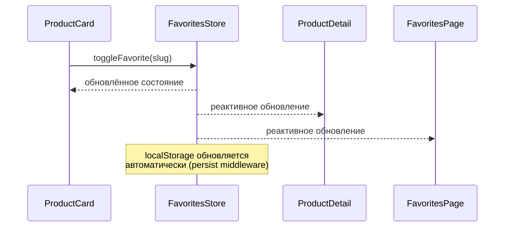

# Архитектура Pineapple Pi 2.0

## Общее описание

Многостраничный веб-сайт (MPA) на Next.js 16 (App Router) с каталогом товаров Pineapple Pi. Сайт использует **Static Site Generation (SSG)** для генерации страниц товаров на этапе сборки, **Zustand** для управления состоянием корзины и избранного с персистентностью в localStorage, и **Chakra UI** для компонентов и стилизации.

### Ключевые архитектурные решения

| Решение | Выбор | Обоснование |
|---------|-------|-------------|
| **Парсинг Markdown** | `gray-matter` + `marked` | `gray-matter` для извлечения метаданных, `marked` для рендеринга HTML |
| **Стратегия рендеринга** | SSG (Static Site Generation) | Все страницы товаров генерируются на этапе сборки |
| **Хранение состояния** | Zustand с `persist` middleware | Легковесное решение с встроенной персистентностью |
| **Структура сторов** | Два отдельных стора | Разделение ответственности: `useCartStore` и `useFavoritesStore` |
| **Темизация** | Chakra UI ColorMode | Встроенная поддержка тем с кастомным акцентным цветом teal |

---

## Схема взаимодействия компонентов

```mermaid
graph TB
    subgraph "Server Components"
        A[layout.tsx<br/>Root Layout] --> B[page.tsx<br/>Home Page]
        A --> C[about/page.tsx]
        A --> D[contact/page.tsx]
        A --> E[favorites/page.tsx]
        A --> F[cart/page.tsx]
        A --> G[product/[slug]/page.tsx<br/>Dynamic SSG]
        
        H[lib/products.ts<br/>parseProducts] --> I[public/products/specification/*.md]
        B --> J[getProducts<br/>build-time]
        G --> J
    end
    
    subgraph "Client Components"
        K[Header] --> L[CartIcon<br/>badge count]
        K --> M[FavoritesIcon]
        N[ProductCard] --> O[FavoriteButton]
        N --> P[AddToCartButton]
        Q[ProductDetail] --> R[QuantityInput]
        Q --> S[FavoriteButton]
        T[CartPage] --> U[CartItem<br/>quantity controls]
        T --> V[DeliveryCheckbox]
        W[ContactForm] --> X[POST /api/feedback]
        Y[OrderSummary] --> Z[POST /api/order]
        AA[CookieBanner]
    end
    
    subgraph "State Management"
        AB[Zustand: useCartStore<br/>persist: localStorage]
        AC[Zustand: useFavoritesStore<br/>persist: localStorage]
    end
    
    subgraph "Providers"
        AD[ChakraProvider<br/>with custom theme]
        AE[CookieConsentProvider]
    end
    
    B --> K
    E --> K
    F --> K
    G --> K
    
    L --> AB
    P --> AB
    U --> AB
    V --> AB
    O --> AC
    M --> AC
    S --> AC
    
    K --> AD
    N --> AD
    Q --> AD
    T --> AD
    W --> AD
    
    AA --> AE
```

---

## Структура папок проекта

```
pineapple-pi-2.0/
├── src/
│   ├── app/
│   │   ├── layout.tsx              # Root layout с ChakraProvider
│   │   ├── page.tsx                # Главная страница (каталог)
│   │   ├── about/
│   │   │   └── page.tsx            # Страница "О компании"
│   │   ├── contact/
│   │   │   └── page.tsx            # Форма обратной связи
│   │   ├── favorites/
│   │   │   └── page.tsx            # Страница избранного
│   │   ├── cart/
│   │   │   └── page.tsx            # Страница корзины
│   │   ├── product/
│   │   │   └── [slug]/
│   │   │       └── page.tsx        # Детальная страница товара (SSG)
│   │   ├── not-found.tsx           # Кастомная 404 страница
│   │   └── globals.css             # Глобальные стили
│   │
│   ├── components/
│   │   ├── layout/
│   │   │   ├── Header.tsx          # Header с навигацией
│   │   │   ├── Footer.tsx          # Footer с 3 колонками
│   │   │   └── index.ts
│   │   ├── product/
│   │   │   ├── ProductCard.tsx     # Карточка товара
│   │   │   ├── ProductGrid.tsx     # Сетка товаров
│   │   │   ├── FavoriteButton.tsx  # Кнопка избранного (сердечко)
│   │   │   ├── AddToCartButton.tsx # Кнопка "В корзину"
│   │   │   └── index.ts
│   │   ├── cart/
│   │   │   ├── CartItem.tsx        # Элемент корзины
│   │   │   ├── DeliveryCheckbox.tsx # Выбор доставки
│   │   │   └── OrderSummary.tsx    # Итоговая сводка
│   │   │   └── index.ts
│   │   ├── ui/
│   │   │   ├── CookieBanner.tsx    # Cookie баннер
│   │   │   └── index.ts
│   │   └── index.ts
│   │
│   ├── lib/
│   │   ├── products.ts             # Парсинг Markdown, getProducts, getProductBySlug
│   │   └── utils.ts                # Утилиты
│   │
│   ├── stores/
│   │   ├── cart.ts                 # useCartStore (Zustand)
│   │   ├── favorites.ts            # useFavoritesStore (Zustand)
│   │   └── index.ts
│   │
│   └── types/
│       ├── product.ts              # TypeScript интерфейсы товаров
│       ├── cart.ts                 # TypeScript интерфейсы корзины
│       └── order.ts                # TypeScript интерфейсы заказа
│
├── public/
│   ├── products/
│   │   ├── specification/          # Markdown файлы спецификаций
│   │   └── images/                 # Изображения товаров
│   └── ...
│
├── docs/
│   └── plans/
│       ├── 001-architecture.md     # Этот файл
│       ├── 001-components.md       # Детали компонентов
│       └── 001-data-flow.md        # Поток данных
│
└── tasks/
    └── 001-pinepple-pi.md          # Исходная задача
```

---

## Модели данных

### Product (Товар)

```typescript
interface Product {
  slug: string;                    // Идентификатор (имя файла без .md)
  title: string;                   // Название из H1
  specifications: string[];        // Массив характеристик
  price: number;                   // Числовая цена (для расчётов)
  formattedPrice: string;          // Форматированная цена (например, "$40")
  imagePath: string;               // Путь к изображению: `/products/images/${slug}.jpg`
  description: string;             // Краткое описание (первые 3 характеристики)
}
```

### CartItem (Элемент корзины)

```typescript
interface CartItem {
  slug: string;                    // Ссылка на товар
  title: string;                   // Название товара
  price: number;                   // Цена на момент добавления
  quantity: number;                // Количество
}
```

### CartStore (Состояние корзины)

```typescript
interface CartState {
  items: CartItem[];               // Список товаров
  deliveryAdded: boolean;          // Флаг добавленной доставки
  
  // Actions
  addItem: (product: Product, quantity?: number) => void;
  removeItem: (slug: string) => void;
  updateQuantity: (slug: string, quantity: number) => void;
  clearCart: () => void;
  toggleDelivery: () => void;
  
  // Getters (вычисляемые значения)
  subtotal: number;                // Сумма товаров
  deliveryCost: number;            // Стоимость доставки (0 или 5)
  total: number;                   // Итоговая сумма
  totalCount: number;              // Общее количество уникальных товаров (для badge)
}
```

### FavoritesStore (Состояние избранного)

```typescript
interface FavoritesState {
  slugs: string[];                 // Массив slug избранных товаров
  
  // Actions
  addFavorite: (slug: string) => void;
  removeFavorite: (slug: string) => void;
  toggleFavorite: (slug: string) => void;
  
  // Getters
  isFavorite: (slug: string) => boolean;
  count: number;                   // Количество избранных товаров
}
```

### Order (Заказ)

```typescript
interface Order {
  items: CartItem[];               // Товары из корзины
  deliveryAdded: boolean;          // Флаг доставки
  subtotal: number;                // Сумма товаров
  deliveryCost: number;            // Стоимость доставки
  total: number;                   // Итоговая сумма
  customer?: {                     // Данные клиента (из формы контакта)
    name: string;
    email: string;
  };
}
```

### Feedback (Обратная связь)

```typescript
interface Feedback {
  name: string;
  email: string;
  message: string;
}
```

---

## Стратегия парсинга Markdown файлов

### Выбор библиотеки

| Библиотека | Назначение | Установка |
|------------|------------|-----------|
| `gray-matter` | Извлечение метаданных из Markdown | `npm install gray-matter` |
| `marked` | Парсинг Markdown в HTML | `npm install marked` |
| `@types/gray-matter` | TypeScript типы | `npm install -D @types/gray-matter` |
| `@types/marked` | TypeScript типы | `npm install -D @types/marked` |

### Функция парсинга

```typescript
// src/lib/products.ts

import fs from 'fs';
import path from 'path';
import matter from 'gray-matter';
import { marked } from 'marked';

const productsDirectory = path.join(process.cwd(), 'public/products/specification');

export function getSlugs(): string[] {
  const fileNames = fs.readdirSync(productsDirectory);
  return fileNames
    .filter(name => name.endsWith('.md'))
    .map(name => name.replace(/\.md$/, ''));
}

export function getProductBySlug(slug: string): Product {
  const fullPath = path.join(productsDirectory, `${slug}.md`);
  const fileContents = fs.readFileSync(fullPath, 'utf8');
  const { data, content } = matter(fileContents);
  
  // Парсим Markdown для извлечения секций
  const sections = parseMarkdownSections(content);
  
  return {
    slug,
    title: extractTitle(content) || data.title || slug,
    specifications: sections.specification || [],
    price: parsePrice(sections.price || ''),
    formattedPrice: sections.price || '',
    imagePath: `/products/images/${slug}.jpg`,
    description: (sections.specification || []).slice(0, 3).join('. '),
  };
}

export function getProducts(): Product[] {
  const slugs = getSlugs();
  return slugs.map(slug => getProductBySlug(slug));
}
```

### Обработка ошибок

- Если файл изображения не найден → использовать placeholder
- Если цена не найдена → установить `0`
- Если спецификация пуста → пустой массив
- Логирование ошибок при сборке (не ломать билд)

---

## План реализации сторов Zustand

### useCartStore

```typescript
// src/stores/cart.ts

import { create } from 'zustand';
import { persist, createJSONStorage } from 'zustand/middleware';
import type { CartItem, CartState } from '@/types/cart';
import type { Product } from '@/types/product';

interface CartStore extends CartState {}

export const useCartStore = create<CartStore>()(
  persist(
    (set, get) => ({
      items: [],
      deliveryAdded: false,
      
      addItem: (product: Product, quantity: number = 1) => {
        set(state => {
          const existing = state.items.find(item => item.slug === product.slug);
          if (existing) {
            return {
              items: state.items.map(item =>
                item.slug === product.slug
                  ? { ...item, quantity: item.quantity + quantity }
                  : item
              ),
            };
          }
          return {
            items: [
              ...state.items,
              {
                slug: product.slug,
                title: product.title,
                price: product.price,
                quantity,
              },
            ],
          };
        });
      },
      
      removeItem: (slug: string) => {
        set(state => ({
          items: state.items.filter(item => item.slug !== slug),
        }));
      },
      
      updateQuantity: (slug: string, quantity: number) => {
        if (quantity <= 0) {
          get().removeItem(slug);
          return;
        }
        set(state => ({
          items: state.items.map(item =>
            item.slug === slug ? { ...item, quantity } : item
          ),
        }));
      },
      
      clearCart: () => {
        set({ items: [], deliveryAdded: false });
      },
      
      toggleDelivery: () => {
        set(state => ({ deliveryAdded: !state.deliveryAdded }));
      },
      
      // Getters
      get subtotal() {
        return this.items.reduce((sum, item) => sum + item.price * item.quantity, 0);
      },
      
      get deliveryCost() {
        return this.deliveryAdded ? 5 : 0;
      },
      
      get total() {
        return this.subtotal + this.deliveryCost;
      },
      
      get totalCount() {
        return this.items.reduce((count, item) => count + item.quantity, 0);
      },
    }),
    {
      name: 'cart-storage',
      storage: createJSONStorage(() => localStorage),
    }
  )
);
```

### useFavoritesStore

```typescript
// src/stores/favorites.ts

import { create } from 'zustand';
import { persist, createJSONStorage } from 'zustand/middleware';

interface FavoritesStore {
  slugs: string[];
  addFavorite: (slug: string) => void;
  removeFavorite: (slug: string) => void;
  toggleFavorite: (slug: string) => void;
  isFavorite: (slug: string) => boolean;
  count: number;
}

export const useFavoritesStore = create<FavoritesStore>()(
  persist(
    (set, get) => ({
      slugs: [],
      
      addFavorite: (slug: string) => {
        set(state => ({
          slugs: [...state.slugs, slug],
        }));
      },
      
      removeFavorite: (slug: string) => {
        set(state => ({
          slugs: state.slugs.filter(s => s !== slug),
        }));
      },
      
      toggleFavorite: (slug: string) => {
        if (get().isFavorite(slug)) {
          get().removeFavorite(slug);
        } else {
          get().addFavorite(slug);
        }
      },
      
      isFavorite: (slug: string) => {
        return get().slugs.includes(slug);
      },
      
      get count() {
        return this.slugs.length;
      },
    }),
    {
      name: 'favorites-storage',
      storage: createJSONStorage(() => localStorage),
    }
  )
);
```

---

## API роуты (моковые)

### POST /api/feedback

**Запрос:**
```typescript
interface FeedbackRequest {
  name: string;
  email: string;
  message: string;
}
```

**Ответ:**
```typescript
interface FeedbackResponse {
  success: boolean;
  message: string;
}
```

**Реализация:**
```typescript
// src/app/api/feedback/route.ts

import { NextRequest, NextResponse } from 'next/server';

export async function POST(request: NextRequest) {
  const body = await request.json();
  
  // Имитация задержки
  await new Promise(resolve => setTimeout(resolve, 500));
  
  // Валидация
  if (!body.name || !body.email || !body.message) {
    return NextResponse.json(
      { success: false, message: 'Все поля обязательны' },
      { status: 400 }
    );
  }
  
  // Логирование (в реальности - отправка)
  console.log('Feedback received:', body);
  
  return NextResponse.json({
    success: true,
    message: 'Спасибо за обратную связь!',
  });
}
```

### POST /api/order

**Запрос:**
```typescript
interface OrderRequest {
  items: CartItem[];
  deliveryAdded: boolean;
  subtotal: number;
  deliveryCost: number;
  total: number;
  customer?: {
    name: string;
    email: string;
  };
}
```

**Ответ:**
```typescript
interface OrderResponse {
  success: boolean;
  orderId: string;
  message: string;
}
```

**Реализация:**
```typescript
// src/app/api/order/route.ts

import { NextRequest, NextResponse } from 'next/server';

export async function POST(request: NextRequest) {
  const body = await request.json();
  
  // Имитация задержки
  await new Promise(resolve => setTimeout(resolve, 1000));
  
  // Валидация
  if (!body.items || body.items.length === 0) {
    return NextResponse.json(
      { success: false, message: 'Корзина пуста' },
      { status: 400 }
    );
  }
  
  // Генерация orderId
  const orderId = `ORD-${Date.now()}-${Math.random().toString(36).slice(2, 8)}`;
  
  // Логирование (в реальности - сохранение в БД)
  console.log('Order received:', { orderId, ...body });
  
  return NextResponse.json({
    success: true,
    orderId,
    message: 'Заказ успешно оформлен!',
  });
}
```

---

## План по адаптиву и темизации

### Адаптивность (Mobile-first)

| Компонент | Mobile (base) | Tablet (md) | Desktop (lg) |
|-----------|---------------|-------------|--------------|
| **Header навигация** | Гамбургер-меню | Горизонтальная | Горизонтальная |
| **Сетка товаров** | 1 колонка | 2 колонки | 3-4 колонки |
| **Footer колонки** | 1 колонка (stack) | 2 колонки | 3 колонки |
| **Карточка товара** | Полная ширина | 50% ширины | 25-33% ширины |
| **Форма контакта** | 1 колонка | 1 колонка | 2 колонки (имя/email) |

### Настройка кастомной темы Chakra UI

```typescript
// src/theme.ts

import { extendTheme } from '@chakra-ui/react';

const colors = {
  accent: {
    50: '#f0fdfa',
    100: '#ccfbf1',
    200: '#99f6e4',
    300: '#5eead4',
    400: '#2dd4bf',
    500: '#14b8a6', // Основной teal
    600: '#0d9488',
    700: '#0f766e',
    800: '#115e59',
    900: '#134e4a',
  },
};

const theme = extendTheme({
  colors,
  semanticTokens: {
    colors: {
      primary: {
        default: 'accent.500',
        _dark: 'accent.400',
      },
    },
  },
  components: {
    Button: {
      defaultProps: {
        colorScheme: 'accent',
      },
    },
  },
});

export default theme;
```

---

## Стратегия работы с изображениями

### Связка файлов

| Файл спецификации | Файл изображения |
|-------------------|------------------|
| `banana-pi-bpi-m4-berry.md` | `banana-pi-bpi-m4-berry.jpg` |
| `pineapple-pi-5.md` | `pineapple-pi-5.png` |

### Оптимизация

```tsx
import Image from 'next/image';

<Image
  src={product.imagePath}
  alt={product.title}
  width={400}
  height={300}
  priority={isHomePage} // Приоритет для главной
  placeholder="blur"
  blurDataURL="data:image/jpeg;base64,..." // Опционально
/>
```

### Fallback

Если изображение не найдено:
- Использовать placeholder из `/public/placeholder-product.svg`
- Не ломать отображение карточки

---

## Cookie-баннер

### Логика работы



### Хранение

```typescript
// Ключ в localStorage
const COOKIE_CONSENT_KEY = 'pineapple-cookie-consent';
// Значение: true | false
```

### Компонент

- Позиция: fixed, bottom-0
- Z-index: выше всех компонентов
- Анимация: slide-up при появлении

---

## Разделение на серверные и клиентские компоненты

### Серверные компоненты (по умолчанию)

| Файл | Причина |
|------|---------|
| `app/layout.tsx` | Root layout |
| `app/page.tsx` | Главная страница с данными |
| `app/about/page.tsx` | Статический контент |
| `app/product/[slug]/page.tsx` | SSG с данными из MD |
| `components/product/ProductGrid.tsx` | Отображение списка |

### Клиентские компоненты (`'use client'`)

| Файл | Причина |
|------|---------|
| `app/contact/page.tsx` | Форма с состоянием |
| `app/cart/page.tsx` | Интерактивность корзины |
| `app/favorites/page.tsx` | Интерактивность избранного |
| `components/layout/Header.tsx` | Навигация, счетчики |
| `components/product/ProductCard.tsx` | Кнопки, hover |
| `components/product/FavoriteButton.tsx` | Zustand state |
| `components/product/AddToCartButton.tsx` | Zustand state |
| `components/cart/CartItem.tsx` | Изменение количества |
| `components/cart/DeliveryCheckbox.tsx` | Zustand state |
| `components/ui/CookieBanner.tsx` | localStorage, state |

---

## Механизм генерации slug

### Из имени файла

```typescript
// Исходное имя файла: banana-pi-bpi-m4-berry.md
const fileName = 'banana-pi-bpi-m4-berry.md';
const slug = fileName.replace(/\.md$/, '');
// Результат: 'banana-pi-bpi-m4-berry'

// URL: /product/banana-pi-bpi-m4-berry
```

### Валидация slug

- Только lowercase буквы, цифры, дефисы
- Запрещены специальные символы
- Максимальная длина: 100 символов

---

## UI компонент выбора доставки

### Спецификация

```tsx
// Компонент: DeliveryCheckbox
// Расположение: Cart page, перед OrderSummary

<Checkbox
  isChecked={deliveryAdded}
  onChange={toggleDelivery}
  colorScheme="accent"
>
  Добавить доставку ($5)
</Checkbox>
```

### Адаптивность

- Mobile: полный ширина, крупный чекбокс
- Desktop: компактное отображение в строке с итогом

---

## Синхронизация состояния избранного

### Механизм



### Реализация

Все компоненты `FavoriteButton` подписываются на `useFavoritesStore`:
- При изменении → все компоненты перерисовываются
- Zustand гарантирует консистентность

---

## Критерии готовности архитектуры

- ✅ Определена стратегия парсинга Markdown (gray-matter + marked)
- ✅ Описана структура данных товара
- ✅ Определена структура папок app/ с новыми страницами
- ✅ Разработан дизайн сторов Zustand (корзина + избранное)
- ✅ Описана логика расчета итоговой суммы
- ✅ Описаны API роуты (/api/feedback, /api/order)
- ✅ Предложена стратегия работы с изображениями
- ✅ Определена логика Cookie-баннера
- ✅ Описана конфигурация кастомной темы Chakra UI
- ✅ Учтено разделение на серверные/клиентские компоненты
- ✅ Описан механизм генерации slug
- ✅ Спроектирован UI компонент выбора доставки
- ✅ Спроектированы компоненты для работы с избранным
- ✅ Описана логика синхронизации состояния избранного
