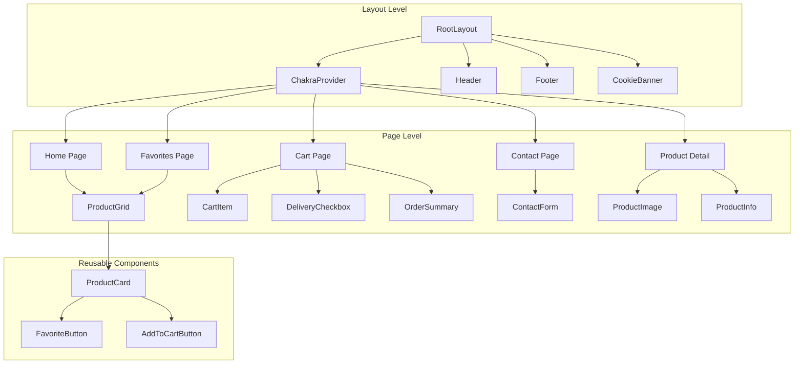

# Спецификация компонентов Pineapple Pi 2.0

## Декомпозиция на компоненты

### Иерархия компонентов



---

## Компонент карточки товара (ProductCard)

### Ответственность

- Отображение превью товара на главной и странице избранного
- Быстрые действия (избранное, корзина)
- Навигация на детальную страницу

### Тип компонента

**Серверный компонент** (по умолчанию) для статических данных + **клиентские кнопки** для интерактивности

### Props

```typescript
interface ProductCardProps {
  product: Product;
  showRemoveFromFavorites?: boolean; // Показывать кнопку удаления из избранного
}
```

### Структура

```tsx
<Card
  as={Link}
  href={`/product/${product.slug}`}
  overflow="hidden"
  role="group"
>
  <Box position="relative">
    <Image
      src={product.imagePath}
      alt={product.title}
      width={400}
      height={300}
      objectFit="cover"
    />
    <FavoriteButton
      slug={product.slug}
      position="absolute"
      top="2"
      right="2"
    />
  </Box>
  
  <CardBody>
    <Heading size="md">{product.title}</Heading>
    <Text color="gray.600" noOfLines={2}>
      {product.description}
    </Text>
    <Flex justify="space-between" align="center" mt="4">
      <Text fontSize="xl" fontWeight="bold">
        {product.formattedPrice}
      </Text>
      <AddToCartButton product={product} />
    </Flex>
  </CardBody>
</Card>
```

### Chakra UI компоненты

| Компонент | Назначение |
|-----------|------------|
| `Card` | Контейнер карточки |
| `CardBody` | Тело карточки |
| `Heading` | Заголовок товара |
| `Text` | Описание и цена |
| `Flex` | Раскладка элементов |
| `Image` | Изображение товара |
| `Box` | Позиционирование кнопки избранного |

### Адаптивность

```tsx
// Сетка товаров (ProductGrid)
<SimpleGrid
  columns={{ base: 1, md: 2, lg: 3, xl: 4 }}
  spacing={{ base: 4, md: 6, lg: 8 }}
>
  {products.map(product => (
    <ProductCard key={product.slug} product={product} />
  ))}
</SimpleGrid>
```

---

## Компонент иконки избранного (FavoriteButton)

### Ответственность

- Переключение состояния избранного
- Визуальная обратная связь (анимация, цвет)
- Toast уведомление при изменении

### Тип компонента

**Клиентский компонент** (`'use client'`)

### Props

```typescript
interface FavoriteButtonProps {
  slug: string;
  size?: 'sm' | 'md' | 'lg';
  position?: 'static' | 'absolute';
  onToggle?: (isFavorite: boolean) => void; // Callback
}
```

### Структура

```tsx
'use client';

import { IconButton, useToast } from '@chakra-ui/react';
import { HeartIcon } from '@chakra-ui/icons';
import { useFavoritesStore } from '@/stores/favorites';

export function FavoriteButton({ 
  slug, 
  size = 'md',
  position = 'static'
}: FavoriteButtonProps) {
  const { isFavorite, toggleFavorite } = useFavoritesStore();
  const toast = useToast();
  const favorite = isFavorite(slug);
  
  const handleClick = (e: React.MouseEvent) => {
    e.preventDefault();
    e.stopPropagation();
    
    const wasFavorite = isFavorite(slug);
    toggleFavorite(slug);
    
    toast({
      title: wasFavorite 
        ? 'Удалено из избранного' 
        : 'Добавлено в избранное',
      status: wasFavorite ? 'info' : 'success',
      duration: 2000,
      isClosable: true,
    });
    
    onToggle?.(!wasFavorite);
  };
  
  return (
    <IconButton
      aria-label={favorite ? 'Удалить из избранного' : 'В избранное'}
      icon={
        <HeartIcon 
          fill={favorite ? 'red.500' : 'none'}
          stroke={favorite ? 'none' : 'currentColor'}
        />
      }
      size={size}
      colorScheme={favorite ? 'red' : 'gray'}
      variant={favorite ? 'solid' : 'outline'}
      onClick={handleClick}
      position={position}
      transition="all 0.2s"
      _hover={{
        transform: 'scale(1.1)',
      }}
    />
  );
}
```

### Chakra UI компоненты

| Компонент | Назначение |
|-----------|------------|
| `IconButton` | Кнопка с иконкой |
| `HeartIcon` | Иконка сердца |
| `useToast` | Уведомления |

### Анимация

- **Hover**: увеличение scale(1.1)
- **Active**: заполнение сердца красным цветом
- **Transition**: 0.2s плавный переход

---

## Компонент детальной страницы товара (ProductDetail)

### Ответственность

- Полная информация о товаре
- Интерактивные элементы (количество, избранное, корзина)
- Отображение всех характеристик

### Тип компонента

**Серверный компонент** для данных + **клиентские подкомпоненты** для интерактивности

### Структура страницы

```tsx
// app/product/[slug]/page.tsx

import { getProductBySlug, getSlugs } from '@/lib/products';
import { notFound } from 'next/navigation';
import Image from 'next/image';
import { FavoriteButton } from '@/components/product/FavoriteButton';
import { AddToCartButton } from '@/components/product/AddToCartButton';
import { QuantityInput } from '@/components/product/QuantityInput';

interface ProductPageProps {
  params: Promise<{ slug: string }>;
}

export async function generateStaticParams() {
  const slugs = getSlugs();
  return slugs.map(slug => ({ slug }));
}

export default async function ProductPage({ params }: ProductPageProps) {
  const { slug } = await params;
  const product = getProductBySlug(slug);
  
  if (!product) {
    notFound();
  }
  
  return (
    <Container maxW="container.xl" py="8">
      <SimpleGrid columns={{ base: 1, md: 2 }} spacing="8">
        {/* Левая колонка: Изображение */}
        <Box position="relative">
          <Image
            src={product.imagePath}
            alt={product.title}
            width={600}
            height={400}
            priority
          />
        </Box>
        
        {/* Правая колонка: Информация */}
        <Stack spacing="6">
          <Flex justify="space-between" align="start">
            <Heading size="xl">{product.title}</Heading>
            <FavoriteButton slug={product.slug} size="lg" />
          </Flex>
          
          <Text fontSize="3xl" fontWeight="bold" color="accent.500">
            {product.formattedPrice}
          </Text>
          
          <Divider />
          
          <Box>
            <Heading size="md" mb="4">Характеристики</Heading>
            <List.Root>
              {product.specifications.map((spec, index) => (
                <List.Item key={index} py="2">
                  • {spec}
                </List.Item>
              ))}
            </List.Root>
          </Box>
          
          <Divider />
          
          <Stack direction={{ base: 'column', sm: 'row' }} gap="4">
            <QuantityInput />
            <AddToCartButton product={product} flex="1" />
          </Stack>
        </Stack>
      </SimpleGrid>
    </Container>
  );
}
```

### Chakra UI компоненты

| Компонент | Назначение |
|-----------|------------|
| `Container` | Центрирование контента |
| `SimpleGrid` | Двухколоночная раскладка |
| `Heading` | Заголовки |
| `Text` | Текст и цена |
| `Divider` | Разделители секций |
| `List.Root`, `List.Item` | Список характеристик |
| `Stack` | Вертикальная/горизонтальная раскладка |
| `Flex` | Горизонтальное выравнивание |
| `Box` | Контейнеры |
| `Image` | Изображение товара |

---

## Компонент выбора доставки (DeliveryCheckbox)

### Ответственность

- Переключение флага доставки в корзине
- Отображение стоимости доставки
- Обновление итоговой суммы

### Тип компонента

**Клиентский компонент** (`'use client'`)

### Props

```typescript
interface DeliveryCheckboxProps {
  // Props не требуются - состояние берётся из useCartStore
}
```

### Структура

```tsx
'use client';

import { Checkbox, Box, Text } from '@chakra-ui/react';
import { useCartStore } from '@/stores/cart';

export function DeliveryCheckbox() {
  const { deliveryAdded, toggleDelivery, subtotal, total } = useCartStore();
  
  return (
    <Box 
      p="4" 
      borderWidth="1px" 
      borderRadius="md"
      bg={deliveryAdded ? 'accent.50' : 'transparent'}
      _dark={{
        bg: deliveryAdded ? 'accent.900/20' : 'transparent'
      }}
    >
      <Checkbox
        isChecked={deliveryAdded}
        onChange={toggleDelivery}
        colorScheme="accent"
        size="lg"
      >
        <Text as="span" fontWeight="medium">
          Добавить доставку
        </Text>
        <Text as="span" color="gray.600" ml="2">
          ($5)
        </Text>
      </Checkbox>
      
      {deliveryAdded && (
        <Text fontSize="sm" color="gray.600" mt="2">
          Стоимость доставки будет добавлена к итоговой сумме
        </Text>
      )}
    </Box>
  );
}
```

### Chakra UI компоненты

| Компонент | Назначение |
|-----------|------------|
| `Checkbox` | Переключатель |
| `Box` | Контейнер с подсветкой |
| `Text` | Текст и цена |

### Адаптивность

- **Mobile**: полная ширина, крупный чекбокс
- **Desktop**: компактное отображение в строке

---

## Компонент сводки корзины (OrderSummary)

### Ответственность

- Отображение разбивки стоимости
- Итоговая сумма
- Кнопка оформления заказа

### Тип компонента

**Клиентский компонент** (`'use client'`)

### Props

```typescript
interface OrderSummaryProps {
  onCheckout: () => void; // Callback для оформления заказа
  isLoading?: boolean;    // Состояние загрузки при отправке заказа
}
```

### Структура

```tsx
'use client';

import { 
  Box, 
  Stack, 
  Text, 
  Divider, 
  Button,
  Flex 
} from '@chakra-ui/react';
import { useCartStore } from '@/stores/cart';

export function OrderSummary({ 
  onCheckout, 
  isLoading = false 
}: OrderSummaryProps) {
  const { subtotal, deliveryCost, total, deliveryAdded } = useCartStore();
  
  return (
    <Box 
      p="6" 
      borderWidth="1px" 
      borderRadius="lg"
      bg="gray.50"
      _dark={{ bg: 'gray.800' }}
    >
      <Heading size="md" mb="4">Итого</Heading>
      
      <Stack spacing="3">
        <Flex justify="space-between">
          <Text>Товары:</Text>
          <Text fontWeight="medium">${subtotal.toFixed(2)}</Text>
        </Flex>
        
        {deliveryAdded && (
          <Flex justify="space-between" color="accent.600">
            <Text>Доставка:</Text>
            <Text fontWeight="medium">${deliveryCost.toFixed(2)}</Text>
          </Flex>
        )}
        
        <Divider />
        
        <Flex justify="space-between" fontSize="xl" fontWeight="bold">
          <Text>Итого:</Text>
          <Text color="accent.500">${total.toFixed(2)}</Text>
        </Flex>
      </Stack>
      
      <Button
        colorScheme="accent"
        size="lg"
        width="full"
        mt="6"
        onClick={onCheckout}
        isLoading={isLoading}
        loadingText="Обработка..."
      >
        Оформить заказ
      </Button>
    </Box>
  );
}
```

### Chakra UI компоненты

| Компонент | Назначение |
|-----------|------------|
| `Box` | Контейнер сводки |
| `Stack` | Вертикальная раскладка |
| `Flex` | Горизонтальное выравнивание |
| `Text` | Текст и суммы |
| `Divider` | Разделитель перед итогом |
| `Button` | Кнопка оформления |
| `Heading` | Заголовок секции |

---

## Страница избранного (FavoritesPage)

### Ответственность

- Отображение сетки избранных товаров
- Пустое состояние с призывом к действию
- Управление избранным (удаление, добавление в корзину)

### Тип компонента

**Клиентский компонент** (требуется доступ к Zustand store)

### Структура

```tsx
'use client';

import { Container, Heading, Box, Text, Button } from '@chakra-ui/react';
import { useFavoritesStore } from '@/stores/favorites';
import { getProducts } from '@/lib/products';
import { ProductGrid } from '@/components/product/ProductGrid';
import Link from 'next/link';

export default function FavoritesPage() {
  const { slugs } = useFavoritesStore();
  const products = getProducts();
  const favoriteProducts = products.filter(p => slugs.includes(p.slug));
  
  if (favoriteProducts.length === 0) {
    return (
      <Container maxW="container.xl" py="8" textAlign="center">
        <Box py="16">
          <Heading size="lg" mb="4">
            Избранное пусто
          </Heading>
          <Text color="gray.600" mb="6">
            Добавьте товары в избранное, чтобы видеть их здесь
          </Text>
          <Button
            as={Link}
            href="/"
            colorScheme="accent"
            size="lg"
          >
            Перейти в каталог
          </Button>
        </Box>
      </Container>
    );
  }
  
  return (
    <Container maxW="container.xl" py="8">
      <Heading size="xl" mb="6">
        Избранное ({favoriteProducts.length})
      </Heading>
      <ProductGrid products={favoriteProducts} showRemoveFromFavorites />
    </Container>
  );
}
```

### Chakra UI компоненты

| Компонент | Назначение |
|-----------|------------|
| `Container` | Центрирование страницы |
| `Heading` | Заголовки |
| `Text` | Описание пустого состояния |
| `Button` | Кнопка перехода в каталог |
| `Box` | Контейнер пустого состояния |

### Пустое состояние

- Заголовок: "Избранное пусто"
- Описание: "Добавьте товары в избранное, чтобы видеть их здесь"
- Кнопка: "Перейти в каталог" → `/`

---

## Компонент элемента корзины (CartItem)

### Ответственность

- Отображение товара в корзине
- Управление количеством (инкремент/декремент/ввод)
- Удаление из корзины

### Тип компонента

**Клиентский компонент** (`'use client'`)

### Props

```typescript
interface CartItemProps {
  item: CartItem;
}
```

### Структура

```tsx
'use client';

import {
  Box,
  Flex,
  Image,
  Text,
  Heading,
  IconButton,
  NumberInput,
  NumberInputField,
  NumberInputStepper,
  NumberIncrementStepper,
  NumberDecrementStepper,
} from '@chakra-ui/react';
import { CloseIcon } from '@chakra-ui/icons';
import { useCartStore } from '@/stores/cart';

export function CartItem({ item }: CartItemProps) {
  const { updateQuantity, removeItem } = useCartStore();
  
  const handleQuantityChange = (value: number) => {
    updateQuantity(item.slug, value);
  };
  
  const handleRemove = () => {
    removeItem(item.slug);
  };
  
  return (
    <Flex 
      gap="4" 
      p="4" 
      borderWidth="1px" 
      borderRadius="md"
      align="start"
    >
      <Image
        src={`/products/images/${item.slug}.jpg`}
        alt={item.title}
        width="100"
        height="100"
        objectFit="cover"
        borderRadius="md"
      />
      
      <Box flex="1">
        <Heading size="md" mb="2">
          {item.title}
        </Heading>
        <Text fontSize="lg" fontWeight="bold" color="accent.500">
          ${item.price.toFixed(2)}
        </Text>
        
        <Flex justify="space-between" align="center" mt="4">
          <NumberInput
            min={1}
            max={99}
            value={item.quantity}
            onChange={handleQuantityChange}
            width="120px"
          >
            <NumberInputField />
            <NumberInputStepper>
              <NumberIncrementStepper />
              <NumberDecrementStepper />
            </NumberInputStepper>
          </NumberInput>
          
          <Text fontWeight="bold">
            ${(item.price * item.quantity).toFixed(2)}
          </Text>
          
          <IconButton
            aria-label="Удалить товар"
            icon={<CloseIcon />}
            variant="ghost"
            colorScheme="red"
            onClick={handleRemove}
          />
        </Flex>
      </Box>
    </Flex>
  );
}
```

### Chakra UI компоненты

| Компонент | Назначение |
|-----------|------------|
| `Flex` | Горизонтальная раскладка |
| `Box` | Контейнер информации |
| `Image` | Изображение товара |
| `Heading` | Название товара |
| `Text` | Цена и сумма |
| `NumberInput` | Ввод количества |
| `NumberInputField` | Поле ввода |
| `NumberInputStepper` | Степпер с кнопками |
| `NumberIncrementStepper` | Кнопка увеличения |
| `NumberDecrementStepper` | Кнопка уменьшения |
| `IconButton` | Кнопка удаления |
| `CloseIcon` | Иконка закрытия |

---

## Компонент добавления в корзину (AddToCartButton)

### Ответственность

- Добавление товара в корзину
- Визуальная обратная связь
- Toast уведомление

### Тип компонента

**Клиентский компонент** (`'use client'`)

### Props

```typescript
interface AddToCartButtonProps {
  product: Product;
  quantity?: number;  // Опциональное количество (для детальной страницы)
  size?: 'sm' | 'md' | 'lg';
  variant?: 'solid' | 'outline' | 'ghost';
  flex?: string;
}
```

### Структура

```tsx
'use client';

import { Button, useToast } from '@chakra-ui/react';
import { ShoppingCartIcon } from '@chakra-ui/icons';
import { useCartStore } from '@/stores/cart';
import type { Product } from '@/types/product';

export function AddToCartButton({
  product,
  quantity = 1,
  size = 'md',
  variant = 'solid',
  flex,
}: AddToCartButtonProps) {
  const { addItem } = useCartStore();
  const toast = useToast();
  
  const handleClick = (e: React.MouseEvent) => {
    e.stopPropagation();
    
    addItem(product, quantity);
    
    toast({
      title: 'Добавлено в корзину',
      description: `${product.title} × ${quantity}`,
      status: 'success',
      duration: 2000,
      isClosable: true,
    });
  };
  
  return (
    <Button
      colorScheme="accent"
      size={size}
      variant={variant}
      onClick={handleClick}
      leftIcon={<ShoppingCartIcon />}
      flex={flex}
    >
      {quantity > 1 ? `В корзину (${quantity})` : 'В корзину'}
    </Button>
  );
}
```

### Chakra UI компоненты

| Компонент | Назначение |
|-----------|------------|
| `Button` | Кнопка действия |
| `ShoppingCartIcon` | Иконка корзины |
| `useToast` | Уведомления |

---

## Компонент ввода количества (QuantityInput)

### Ответственность

- Выбор количества товара на детальной странице
- Ввод вручную или через степер

### Тип компонента

**Клиентский компонент** (`'use client'`)

### Props

```typescript
interface QuantityInputProps {
  defaultValue?: number;
  onChange?: (quantity: number) => void;
  max?: number;
}
```

### Структура

```tsx
'use client';

import {
  NumberInput,
  NumberInputField,
  NumberInputStepper,
  NumberIncrementStepper,
  NumberDecrementStepper,
  Text,
  Flex,
} from '@chakra-ui/react';
import { useState } from 'react';

export function QuantityInput({
  defaultValue = 1,
  onChange,
  max = 99,
}: QuantityInputProps) {
  const [quantity, setQuantity] = useState(defaultValue);
  
  const handleChange = (value: number) => {
    setQuantity(value);
    onChange?.(value);
  };
  
  return (
    <Flex align="center" gap="2">
      <Text fontWeight="medium">Количество:</Text>
      <NumberInput
        min={1}
        max={max}
        value={quantity}
        onChange={handleChange}
        width="100px"
        size="lg"
      >
        <NumberInputField />
        <NumberInputStepper>
          <NumberIncrementStepper />
          <NumberDecrementStepper />
        </NumberInputStepper>
      </NumberInput>
    </Flex>
  );
}
```

### Chakra UI компоненты

| Компонент | Назначение |
|-----------|------------|
| `NumberInput` | Контейнер ввода числа |
| `NumberInputField` | Поле ввода |
| `NumberInputStepper` | Степпер |
| `NumberIncrementStepper` | Кнопка + |
| `NumberDecrementStepper` | Кнопка - |
| `Flex` | Раскладка |
| `Text` | Лейбл |

---

## Header компонент

### Ответственность

- Горизонтальная навигация
- Иконка корзины с badge
- Иконка избранного
- Переключатель темы (Chakra UI)

### Тип компонента

**Клиентский компонент** (интерактивность, Zustand)

### Props

```typescript
interface HeaderProps {
  // Props не требуются
}
```

### Структура

```tsx
'use client';

import {
  Box,
  Flex,
  HStack,
  Button,
  IconButton,
  Badge,
  useColorMode,
  useColorModeValue,
} from '@chakra-ui/react';
import { MoonIcon, SunIcon } from '@chakra-ui/icons';
import { ShoppingCartIcon, HeartIcon } from '@chakra-ui/icons';
import { useCartStore } from '@/stores/cart';
import { useFavoritesStore } from '@/stores/favorites';
import Link from 'next/link';

export function Header() {
  const { totalCount } = useCartStore();
  const { count: favoritesCount } = useFavoritesStore();
  const { colorMode, toggleColorMode } = useColorMode();
  const bgColor = useColorModeValue('white', 'gray.800');
  const borderColor = useColorModeValue('gray.200', 'gray.700');
  
  return (
    <Box
      as="header"
      bg={bgColor}
      borderBottomWidth="1px"
      borderColor={borderColor}
      position="sticky"
      top="0"
      zIndex="100"
    >
      <Flex
        maxW="container.xl"
        mx="auto"
        px="4"
        py="4"
        justify="space-between"
        align="center"
      >
        {/* Логотип */}
        <Link href="/">
          <Heading size="lg" color="accent.500">
            Pineapple Pi
          </Heading>
        </Link>
        
        {/* Навигация */}
        <HStack spacing="4" display={{ base: 'none', md: 'flex' }}>
          <Button variant="ghost" as={Link} href="/">
            Главная
          </Button>
          <Button variant="ghost" as={Link} href="/about">
            О компании
          </Button>
          <Button variant="ghost" as={Link} href="/contact">
            Контакты
          </Button>
          <Button 
            variant="ghost" 
            as={Link} 
            href="/favorites"
            leftIcon={<HeartIcon fill={favoritesCount > 0 ? 'red.500' : 'none'} />}
          >
            Избранное
            {favoritesCount > 0 && (
              <Badge ml="1" colorScheme="red">
                {favoritesCount}
              </Badge>
            )}
          </Button>
        </HStack>
        
        {/* Правая часть: Корзина + Тема */}
        <HStack spacing="2">
          <IconButton
            aria-label="Корзина"
            icon={
              <Box position="relative">
                <ShoppingCartIcon />
                {totalCount > 0 && (
                  <Badge
                    position="absolute"
                    top="-1"
                    right="-1"
                    colorScheme="accent"
                    fontSize="0.6em"
                    borderRadius="full"
                  >
                    {totalCount}
                  </Badge>
                )}
              </Box>
            }
            variant="ghost"
            as={Link}
            href="/cart"
          />
          
          <IconButton
            aria-label="Переключить тему"
            icon={colorMode === 'dark' ? <SunIcon /> : <MoonIcon />}
            variant="ghost"
            onClick={toggleColorMode}
          />
        </HStack>
      </Flex>
    </Box>
  );
}
```

### Chakra UI компоненты

| Компонент | Назначение |
|-----------|------------|
| `Box` | Контейнер header |
| `Flex` | Раскладка содержимого |
| `HStack` | Горизонтальный стек |
| `Button` | Кнопки навигации |
| `IconButton` | Иконки корзины и темы |
| `Badge` | Счетчики товаров |
| `Heading` | Логотип |
| `useColorMode` | Переключение темы |
| `useColorModeValue` | Цвета в зависимости от темы |

### Адаптивность

- **Mobile**: навигация скрывается, остаются только иконки
- **Desktop**: полная навигация + иконки

---

## Footer компонент

### Ответственность

- Три колонки информации
- Навигация
- Контакты
- Копирайт

### Тип компонента

**Серверный компонент** (статический контент)

### Структура

```tsx
import {
  Box,
  Container,
  SimpleGrid,
  Text,
  Link,
  Heading,
  Stack,
} from '@chakra-ui/react';

const navigationLinks = [
  { label: 'Главная', href: '/' },
  { label: 'Каталог', href: '/#catalog' },
  { label: 'О компании', href: '/about' },
  { label: 'Контакты', href: '/contact' },
];

const contacts = {
  email: 'info@pineapplepi.com',
  phone: '+1 (555) 123-4567',
  address: '123 Pineapple Street, Tech City, TC 12345',
};

export function Footer() {
  return (
    <Box
      as="footer"
      bg="gray.100"
      _dark={{ bg: 'gray.900' }}
      borderTopWidth="1px"
      borderColor="gray.200"
      _dark={{ borderColor: 'gray.700' }}
      mt="auto"
    >
      <Container maxW="container.xl" py="8">
        <SimpleGrid
          columns={{ base: 1, md: 3 }}
          spacing="8"
        >
          {/* Навигация */}
          <Stack spacing="4">
            <Heading size="md">Навигация</Heading>
            <Stack spacing="2">
              {navigationLinks.map(link => (
                <Link
                  key={link.href}
                  href={link.href}
                  color="gray.600"
                  _hover={{ color: 'accent.500' }}
                >
                  {link.label}
                </Link>
              ))}
            </Stack>
          </Stack>
          
          {/* Контакты */}
          <Stack spacing="4">
            <Heading size="md">Контакты</Heading>
            <Stack spacing="2" color="gray.600">
              <Text>{contacts.email}</Text>
              <Text>{contacts.phone}</Text>
              <Text>{contacts.address}</Text>
            </Stack>
          </Stack>
          
          {/* Копирайт */}
          <Stack spacing="4">
            <Heading size="md">Pineapple Pi</Heading>
            <Text color="gray.600">
              © {new Date().getFullYear()} Pineapple Pi.
              <br />
              Все права защищены.
            </Text>
          </Stack>
        </SimpleGrid>
      </Container>
    </Box>
  );
}
```

### Chakra UI компоненты

| Компонент | Назначение |
|-----------|------------|
| `Box` | Контейнер footer |
| `Container` | Центрирование |
| `SimpleGrid` | Сетка колонок |
| `Heading` | Заголовки секций |
| `Stack` | Вертикальная раскладка |
| `Link` | Ссылки навигации |
| `Text` | Текст контактов |

### Адаптивность

- **Mobile**: 1 колонка (stack)
- **Tablet**: 2 колонки
- **Desktop**: 3 колонки

---

## CookieBanner компонент

### Ответственность

- Запрос согласия на cookies
- Одноразовое отображение
- Сохранение в localStorage

### Тип компонента

**Клиентский компонент** (`'use client'`)

### Структура

```tsx
'use client';

import {
  Box,
  Container,
  Text,
  Button,
  Flex,
  useDisclosure,
  useBreakpointValue,
} from '@chakra-ui/react';
import { useEffect, useState } from 'react';

const COOKIE_CONSENT_KEY = 'pineapple-cookie-consent';

export function CookieBanner() {
  const [show, setShow] = useState(false);
  const bannerPosition = useBreakpointValue({
    base: 'bottom',
    md: 'bottom-right',
  });
  
  useEffect(() => {
    const consent = localStorage.getItem(COOKIE_CONSENT_KEY);
    if (!consent) {
      setShow(true);
    }
  }, []);
  
  const handleAccept = () => {
    localStorage.setItem(COOKIE_CONSENT_KEY, 'true');
    setShow(false);
  };
  
  if (!show) {
    return null;
  }
  
  return (
    <Box
      position="fixed"
      bottom="0"
      right="0"
      left="0"
      mdRight="4"
      mdBottom="4"
      mdLeft="auto"
      mdWidth="400px"
      bg="gray.900"
      color="white"
      p="4"
      zIndex="9999"
      boxShadow="lg"
      borderRadius="md"
      mdBorderRadius="lg"
    >
      <Container maxW="container.xl" px="0">
        <Text mb="4" fontSize="sm">
          Мы используем cookies для улучшения работы сайта.
          Продолжая использовать сайт, вы соглашаетесь с нашей
          политикой конфиденциальности.
        </Text>
        <Flex justify="flex-end">
          <Button
            colorScheme="accent"
            size="sm"
            onClick={handleAccept}
          >
            Принять
          </Button>
        </Flex>
      </Container>
    </Box>
  );
}
```

### Chakra UI компоненты

| Компонент | Назначение |
|-----------|------------|
| `Box` | Контейнер баннера |
| `Container` | Внутренний контейнер |
| `Text` | Текст сообщения |
| `Button` | Кнопка принятия |
| `Flex` | Раскладка кнопки |

### Логика показа

1. При загрузке проверяем `localStorage.getItem('pineapple-cookie-consent')`
2. Если не найдено → показываем баннер
3. При нажатии "Принять" → сохраняем флаг в localStorage

---

## Настройка кастомной темы Chakra UI

### Расширение темы

```typescript
// src/theme.ts

import { extendTheme } from '@chakra-ui/react';

const colors = {
  accent: {
    50: '#f0fdfa',
    100: '#ccfbf1',
    200: '#99f6e4',
    300: '#5eead4',
    400: '#2dd4bf',
    500: '#14b8a6',
    600: '#0d9488',
    700: '#0f766e',
    800: '#115e59',
    900: '#134e4a',
  },
};

const theme = extendTheme({
  colors,
  semanticTokens: {
    colors: {
      primary: {
        default: 'accent.500',
        _dark: 'accent.400',
      },
      secondary: {
        default: 'accent.600',
        _dark: 'accent.300',
      },
    },
  },
  components: {
    Button: {
      defaultProps: {
        colorScheme: 'accent',
      },
      baseStyle: {
        fontWeight: 'medium',
      },
    },
    Card: {
      baseStyle: {
        container: {
          borderRadius: 'lg',
          overflow: 'hidden',
        },
      },
    },
    Badge: {
      defaultProps: {
        colorScheme: 'accent',
      },
    },
    Checkbox: {
      defaultProps: {
        colorScheme: 'accent',
      },
    },
  },
});

export default theme;
```

### Интеграция в layout

```tsx
// src/app/layout.tsx

import { ChakraProvider, defaultSystem } from '@chakra-ui/react';
import { theme } from '@/theme';

export default function RootLayout({ children }: { children: React.ReactNode }) {
  return (
    <html lang="ru">
      <body>
        <ChakraProvider theme={theme}>
          {children}
        </ChakraProvider>
      </body>
    </html>
  );
}
```

---

## Сводная таблица компонентов

| Компонент | Тип | Путь | Chakra UI компоненты |
|-----------|-----|------|---------------------|
| ProductCard | Server | `@/components/product/ProductCard` | Card, CardBody, Heading, Text, Flex, Image, Box |
| FavoriteButton | Client | `@/components/product/FavoriteButton` | IconButton, HeartIcon, useToast |
| AddToCartButton | Client | `@/components/product/AddToCartButton` | Button, ShoppingCartIcon, useToast |
| ProductGrid | Server | `@/components/product/ProductGrid` | SimpleGrid |
| QuantityInput | Client | `@/components/product/QuantityInput` | NumberInput*, Flex, Text |
| CartItem | Client | `@/components/cart/CartItem` | Flex, Box, Image, Heading, Text, NumberInput*, IconButton, CloseIcon |
| DeliveryCheckbox | Client | `@/components/cart/DeliveryCheckbox` | Checkbox, Box, Text |
| OrderSummary | Client | `@/components/cart/OrderSummary` | Box, Stack, Flex, Text, Divider, Button, Heading |
| Header | Client | `@/components/layout/Header` | Box, Flex, HStack, Button, IconButton, Badge, Heading, useColorMode* |
| Footer | Server | `@/components/layout/Footer` | Box, Container, SimpleGrid, Heading, Stack, Link, Text |
| CookieBanner | Client | `@/components/ui/CookieBanner` | Box, Container, Text, Button, Flex |

\* NumberInput включает: NumberInputField, NumberInputStepper, NumberIncrementStepper, NumberDecrementStepper
\* useColorMode включает: useColorMode, useColorModeValue
