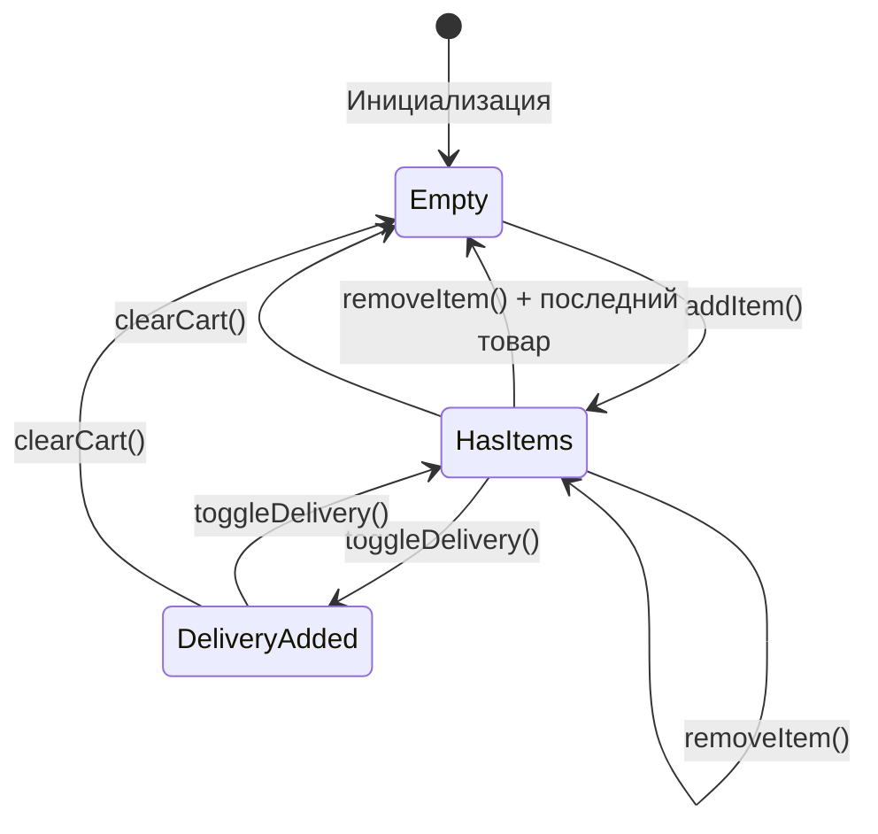
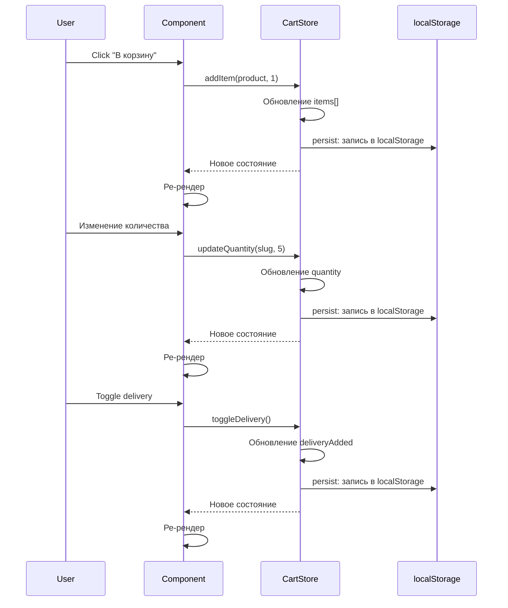
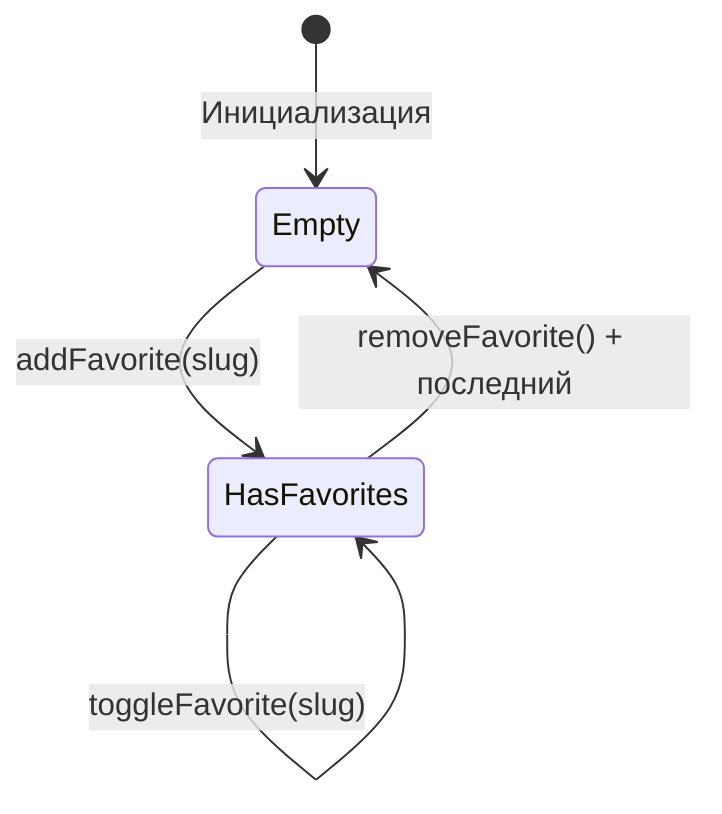
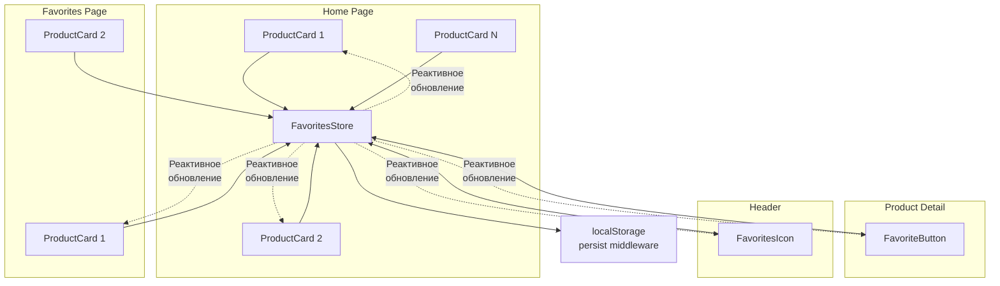
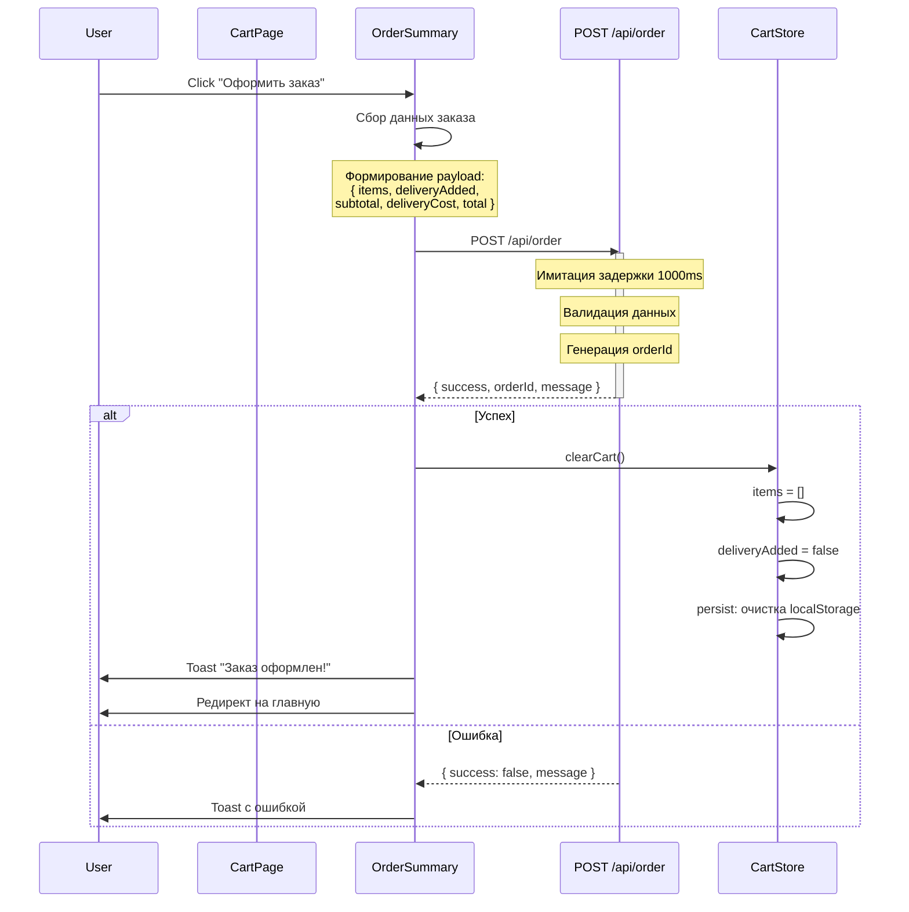
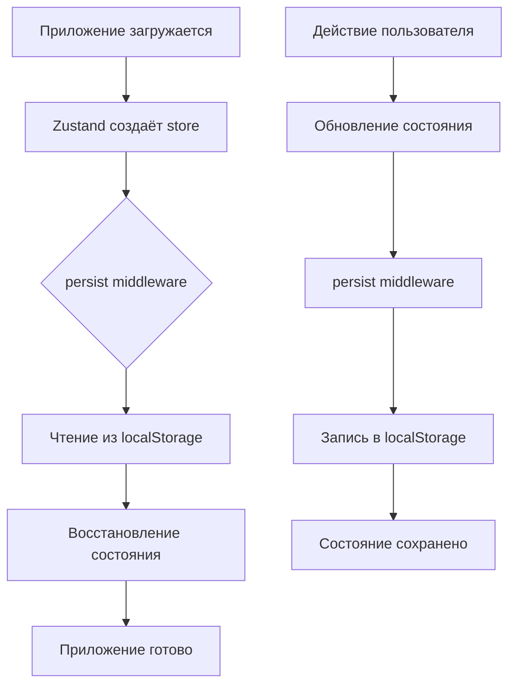
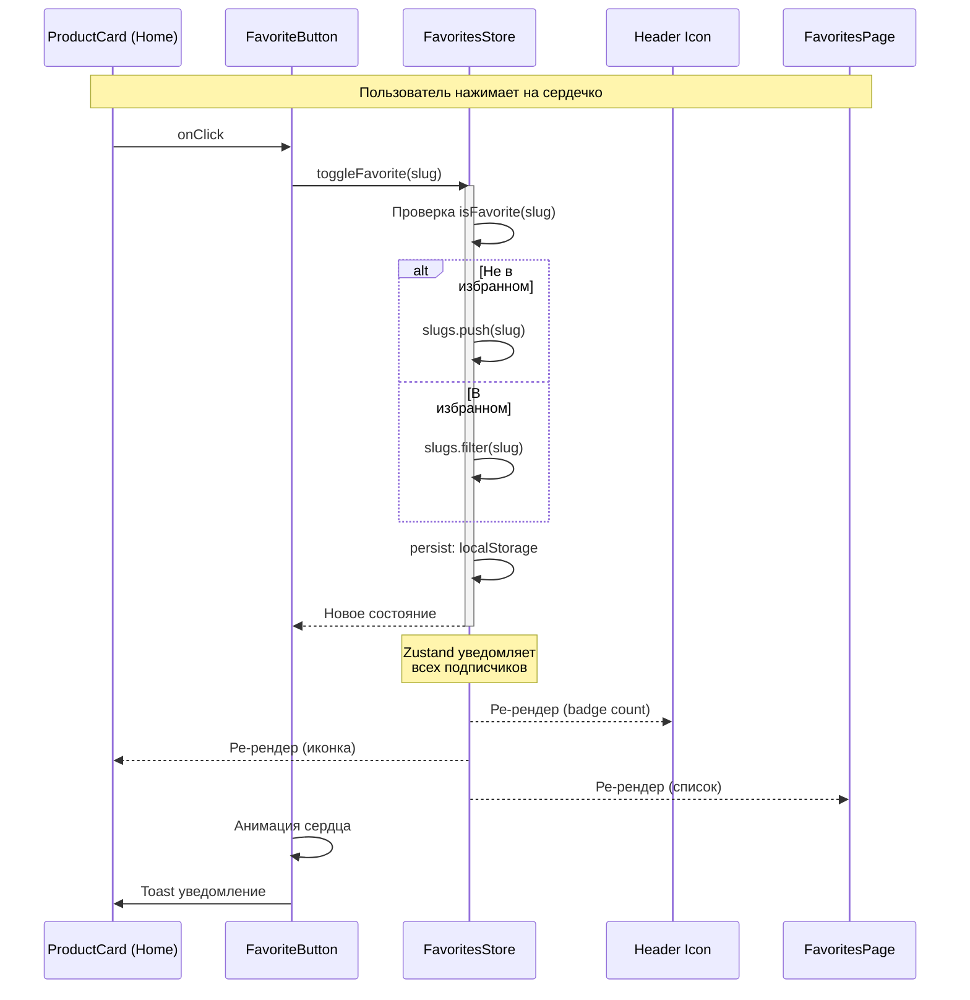
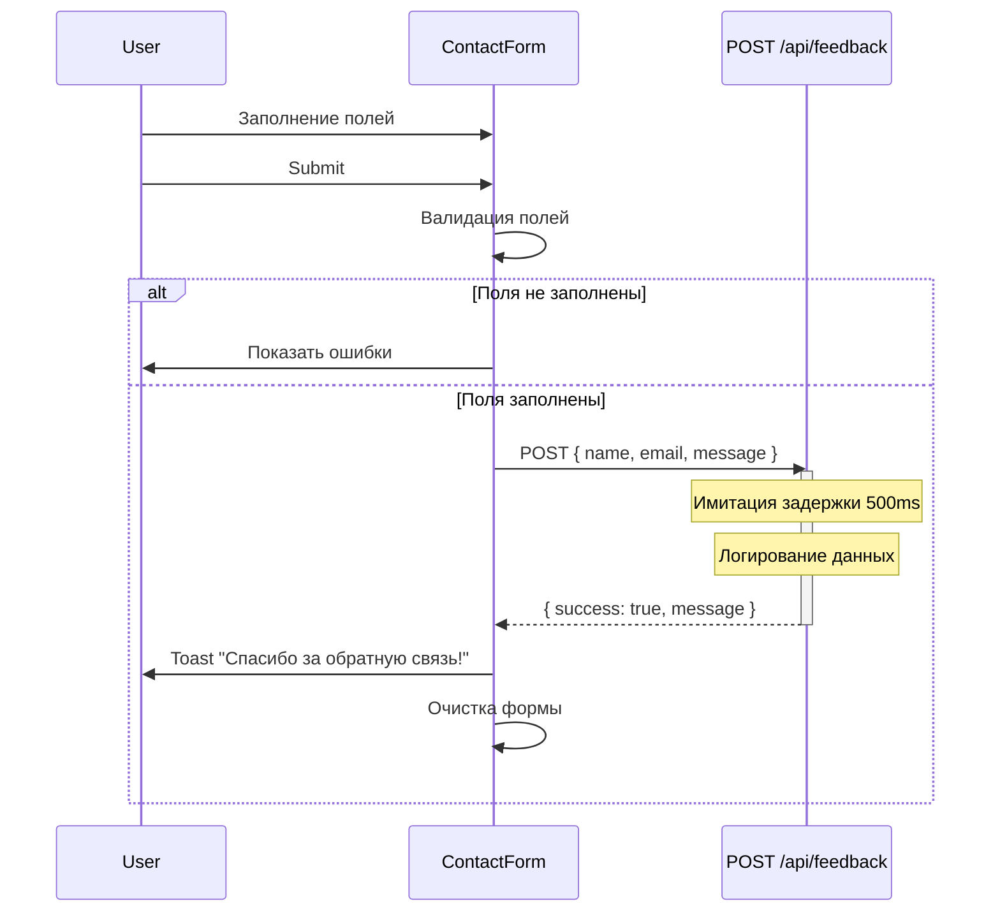
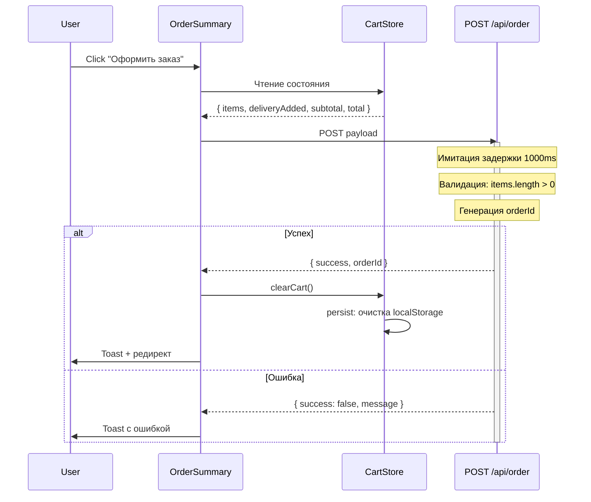

# Поток данных Pineapple Pi 2.0

## Схема загрузки данных (Build-time)

```mermaid
graph TB
    subgraph "Build Time (SSG)"
        A[public/products/specification/*.md] --> B[lib/products.ts<br/>getProducts]
        B --> C{Парсинг}
        C --> D[gray-matter<br/>извлечение заголовка]
        C --> E[marked<br/>парсинг секций]
        D --> F[Product.title]
        E --> G[Product.specifications]
        E --> H[Product.price]
        F --> I[Массив Product[]]
        G --> I
        H --> I
        
        I --> J[app/page.tsx<br/>Home Page]
        I --> K[app/product/[slug]/page.tsx<br/>generateStaticParams]
        
        K --> L[getProductBySlug<br/>для каждого slug]
        L --> M[Статические HTML<br/>файлы в .next/]
        J --> N[Статический HTML<br/>главной страницы]
    end
    
    subgraph "Runtime (Client)"
        O[localStorage] --> P[Zustand Stores]
        P --> Q[useCartStore]
        P --> R[useFavoritesStore]
        
        Q --> S[Cart Page]
        Q --> T[Header CartIcon]
        Q --> U[OrderSummary]
        
        R --> V[Favorites Page]
        R --> W[FavoriteButton]
        R --> X[Header FavoritesIcon]
    end
```

### Этапы сборки

1. **Чтение файлов**: `fs.readdirSync` сканирует `public/products/specification/`
2. **Парсинг каждого файла**:
   - `gray-matter` извлекает заголовок H1
   - `marked` парсит Markdown, выделяем секции `## Specification` и `## Price`
3. **Генерация массива товаров**: `Product[]`
4. **Генерация статических страниц**:
   - Главная страница получает весь массив товаров
   - Детальные страницы генерируются через `generateStaticParams`

### Обработка ошибок при парсинге

```typescript
// src/lib/products.ts

export function getProductBySlug(slug: string): Product {
  try {
    const fullPath = path.join(productsDirectory, `${slug}.md`);
    const fileContents = fs.readFileSync(fullPath, 'utf8');
    const { data, content } = matter(fileContents);
    
    const sections = parseMarkdownSections(content);
    
    // Fallback для отсутствующих данных
    const title = extractTitle(content) || data.title || slug;
    const specifications = sections.specification || [];
    const priceSection = sections.price || '$0';
    const price = parsePrice(priceSection);
    
    // Проверка существования изображения
    const imagePath = `/products/images/${slug}.jpg`;
    const imageExists = checkImageExists(imagePath);
    
    return {
      slug,
      title,
      specifications,
      price,
      formattedPrice: priceSection,
      imagePath: imageExists ? imagePath : '/placeholder-product.jpg',
      description: specifications.slice(0, 3).join('. '),
    };
  } catch (error) {
    console.error(`Error parsing product "${slug}":`, error);
    
    // Возвращаем дефолтный объект (не ломаем билд)
    return {
      slug,
      title: slug,
      specifications: [],
      price: 0,
      formattedPrice: '$0',
      imagePath: '/placeholder-product.jpg',
      description: '',
    };
  }
}
```

---

## Логика работы корзины

### State машина корзины



### Действия (Actions)

#### addItem(product, quantity)

```typescript
addItem: (product: Product, quantity: number = 1) => {
  set(state => {
    const existing = state.items.find(item => item.slug === product.slug);
    
    if (existing) {
      // Товар уже есть → увеличиваем количество
      return {
        items: state.items.map(item =>
          item.slug === product.slug
            ? { ...item, quantity: item.quantity + quantity }
            : item
        ),
      };
    }
    
    // Новый товар → добавляем в массив
    return {
      items: [
        ...state.items,
        {
          slug: product.slug,
          title: product.title,
          price: product.price,
          quantity,
        },
      ],
    };
  });
}
```

#### removeItem(slug)

```typescript
removeItem: (slug: string) => {
  set(state => ({
    items: state.items.filter(item => item.slug !== slug),
  }));
}
```

#### updateQuantity(slug, quantity)

```typescript
updateQuantity: (slug: string, quantity: number) => {
  if (quantity <= 0) {
    // Если количество 0 или меньше → удаляем товар
    get().removeItem(slug);
    return;
  }
  
  set(state => ({
    items: state.items.map(item =>
      item.slug === slug ? { ...item, quantity } : item
    ),
  }));
}
```

#### toggleDelivery()

```typescript
toggleDelivery: () => {
  set(state => ({ deliveryAdded: !state.deliveryAdded }));
}
```

### Мутации состояния



---

## Логика работы избранного

### State машина избранного



### Действия (Actions)

#### addFavorite(slug)

```typescript
addFavorite: (slug: string) => {
  set(state => ({
    slugs: [...state.slugs, slug],
  }));
}
```

#### removeFavorite(slug)

```typescript
removeFavorite: (slug: string) => {
  set(state => ({
    slugs: state.slugs.filter(s => s !== slug),
  }));
}
```

#### toggleFavorite(slug)

```typescript
toggleFavorite: (slug: string) => {
  if (get().isFavorite(slug)) {
    get().removeFavorite(slug);
  } else {
    get().addFavorite(slug);
  }
}
```

#### isFavorite(slug) - Getter

```typescript
isFavorite: (slug: string) => {
  return get().slugs.includes(slug);
}
```

### Синхронизация между страницами



**Механизм:**
1. Все компоненты подписываются на `useFavoritesStore()`
2. При вызове `toggleFavorite(slug)` Zustand обновляет состояние
3. Все подписанные компоненты получают новое состояние → ре-рендер
4. `persist` middleware автоматически сохраняет в localStorage

---

## Схема расчета итоговой суммы

### Реактивные вычисления в сторе

```typescript
// Геттеры вычисляются автоматически при каждом доступе
get subtotal() {
  // Сумма всех товаров: цена × количество
  return this.items.reduce((sum, item) => sum + item.price * item.quantity, 0);
}

get deliveryCost() {
  // $5 если доставка добавлена, иначе $0
  return this.deliveryAdded ? 5 : 0;
}

get total() {
  // Итоговая сумма
  return this.subtotal + this.deliveryCost;
}

get totalCount() {
  // Общее количество товаров (для badge в header)
  return this.items.reduce((count, item) => count + item.quantity, 0);
}
```

### Диаграмма вычислений

```mermaid
graph LR
    subgraph "Входные данные"
        A[items[]] --> B[subtotal]
        C[deliveryAdded] --> D[deliveryCost]
    end
    
    subgraph "Вычисления"
        B --> E[total]
        D --> E
        A --> F[totalCount]
    end
    
    subgraph "Отображение"
        E --> G[OrderSummary]
        F --> H[Header CartIcon badge]
    end
```

### Пример расчёта

```typescript
// Состояние корзины
{
  items: [
    { slug: 'pineapple-pi-5', price: 60, quantity: 2 },
    { slug: 'banana-pi-m4', price: 40, quantity: 1 },
  ],
  deliveryAdded: true,
}

// Вычисления
subtotal = (60 × 2) + (40 × 1) = 120 + 40 = $160
deliveryCost = 5 (т.к. deliveryAdded: true)
total = 160 + 5 = $165
totalCount = 2 + 1 = 3 товара
```

---

## Жизненный цикл оформления заказа



### Payload заказа

```typescript
interface OrderPayload {
  items: [
    {
      slug: string;
      title: string;
      price: number;
      quantity: number;
    }
  ];
  deliveryAdded: boolean;
  subtotal: number;
  deliveryCost: number;
  total: number;
  customer?: {
    name: string;
    email: string;
  };
}
```

### Обработка ответа

```typescript
// CartPage.tsx

const handleCheckout = async () => {
  setIsLoading(true);
  
  try {
    const payload = {
      items,
      deliveryAdded,
      subtotal,
      deliveryCost,
      total,
    };
    
    const response = await fetch('/api/order', {
      method: 'POST',
      headers: { 'Content-Type': 'application/json' },
      body: JSON.stringify(payload),
    });
    
    const data = await response.json();
    
    if (data.success) {
      // Очистка корзины
      clearCart();
      
      // Уведомление
      toast({
        title: 'Заказ оформлен!',
        description: `Номер заказа: ${data.orderId}`,
        status: 'success',
        duration: 5000,
      });
      
      // Редирект
      router.push('/');
    } else {
      throw new Error(data.message);
    }
  } catch (error) {
    toast({
      title: 'Ошибка оформления',
      description: error.message,
      status: 'error',
      duration: 5000,
    });
  } finally {
    setIsLoading(false);
  }
};
```

---

## Интеграция Zustand с Chakra UI

### Уведомления (Toast)

```typescript
// Использование в компонентах

import { useToast } from '@chakra-ui/react';

export function AddToCartButton({ product }) {
  const { addItem } = useCartStore();
  const toast = useToast();
  
  const handleClick = () => {
    addItem(product);
    
    toast({
      title: 'Добавлено в корзину',
      description: product.title,
      status: 'success',
      duration: 2000,
      isClosable: true,
      position: 'top-right',
    });
  };
  
  return <Button onClick={handleClick}>В корзину</Button>;
}
```

### Позиции Toast

| Позиция | Описание |
|---------|----------|
| `top` | Сверху по центру |
| `top-right` | Сверху справа |
| `top-left` | Сверху слева |
| `bottom` | Снизу по центру |
| `bottom-right` | Снизу справа |
| `bottom-left` | Снизу слева |

### Типы статусов

- `success` — зелёный (успешное действие)
- `error` — красный (ошибка)
- `warning` — оранжевый (предупреждение)
- `info` — синий (информация)

---

## Персистентность данных

### localStorage структура

```javascript
// Ключи в localStorage
{
  "cart-storage": JSON.stringify({
    state: {
      items: [...],
      deliveryAdded: true/false
    }
  }),
  
  "favorites-storage": JSON.stringify({
    state: {
      slugs: [...]
    }
  }),
  
  "pineapple-cookie-consent": "true"
}
```

### Настройка persist middleware

```typescript
// src/stores/cart.ts

import { persist, createJSONStorage } from 'zustand/middleware';

export const useCartStore = create<CartStore>()(
  persist(
    (set, get) => ({
      // ... state и actions
    }),
    {
      name: 'cart-storage',                    // Ключ в localStorage
      storage: createJSONStorage(() => localStorage), // Хранилище
      partialize: (state) => ({               // Опционально: что сохранять
        items: state.items,
        deliveryAdded: state.deliveryAdded,
      }),
      onRehydrateStorage: () => (state, error) => {
        // Опционально: обработка ошибок десериализации
        if (error) {
          console.error('Failed to rehydrate cart:', error);
        }
      },
    }
  )
);
```

### Жизненный цикл персистентности



### Очистка данных

```typescript
// Принудительная очистка (например, после заказа)
clearCart: () => {
  set({ items: [], deliveryAdded: false });
  // persist автоматически обновит localStorage
}

// Полная очистка localStorage (для отладки)
localStorage.removeItem('cart-storage');
localStorage.removeItem('favorites-storage');
```

---

## Взаимодействие компонентов при добавлении/удалении из избранного

### Sequence Diagram



### Компоненты-подписчики

| Компонент | Подписка | Реакция |
|-----------|----------|---------|
| `FavoriteButton` (Home) | `isFavorite(slug)` | Заполнение сердца |
| `FavoriteButton` (Detail) | `isFavorite(slug)` | Заполнение сердца |
| `FavoriteButton` (Favorites) | `isFavorite(slug)` | Заполнение сердца |
| `Header` (иконка) | `count` | Badge счётчик |
| `FavoritesPage` | `slugs` | Список товаров |
| `ProductCard` (через FavoriteButton) | `isFavorite(slug)` | Иконка |

---

## Интеграция с моковыми API

### POST /api/feedback



### POST /api/order



---

## Сводная схема потока данных

```mermaid
graph TB
    subgraph "Build Time"
        MD[public/products/specification/*.md] --> PARSE[lib/products.ts<br/>parseProducts]
        PARSE --> PROD[Product[]]
        PROD --> HOME[app/page.tsx]
        PROD --> DETAIL[app/product/[slug]/page.tsx]
        
        HOME --> HTML1[Static HTML<br/>/]
        DETAIL --> HTML2[Static HTML<br/>/product/*]
    end
    
    subgraph "Client Side"
        LS[localStorage] --> ZUSTAND[Zustand Stores]
        
        ZUSTAND --> CART[useCartStore]
        ZUSTAND --> FAV[useFavoritesStore]
        
        CART --> CART_PAGE[app/cart/page.tsx]
        CART --> HEADER[Header]
        CART --> ORDER[OrderSummary]
        
        FAV --> FAV_PAGE[app/favorites/page.tsx]
        FAV --> FAV_BTN[FavoriteButton]
        FAV --> HEADER
        
        CART_PAGE --> API_ORDER[POST /api/order]
        CONTACT[app/contact/page.tsx] --> API_FEEDBACK[POST /api/feedback]
    end
    
    subgraph "User Actions"
        USER[Пользователь] --> ADD_CART[Добавить в корзину]
        USER --> TOGGLE_FAV[Переключить избранное]
        USER --> CHECKOUT[Оформить заказ]
        USER --> SEND_FB[Отправить форму]
        
        ADD_CART --> CART
        TOGGLE_FAV --> FAV
        CHECKOUT --> API_ORDER
        SEND_FB --> API_FEEDBACK
    end
```
