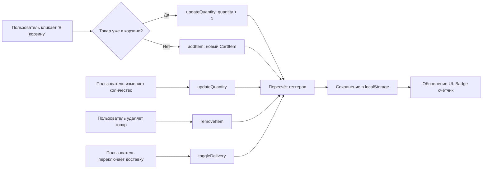
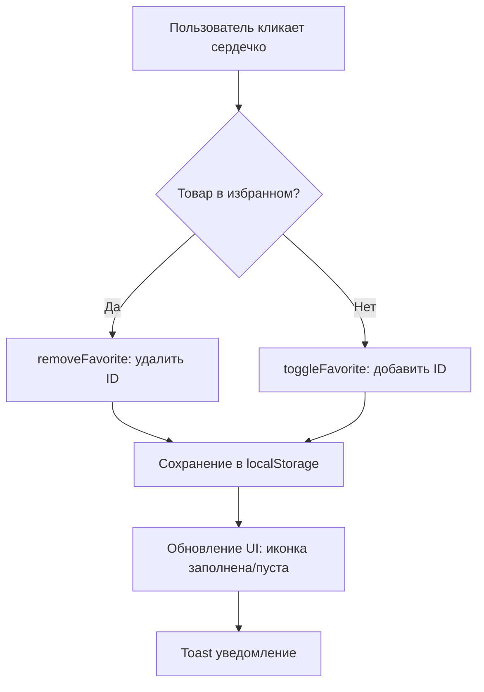
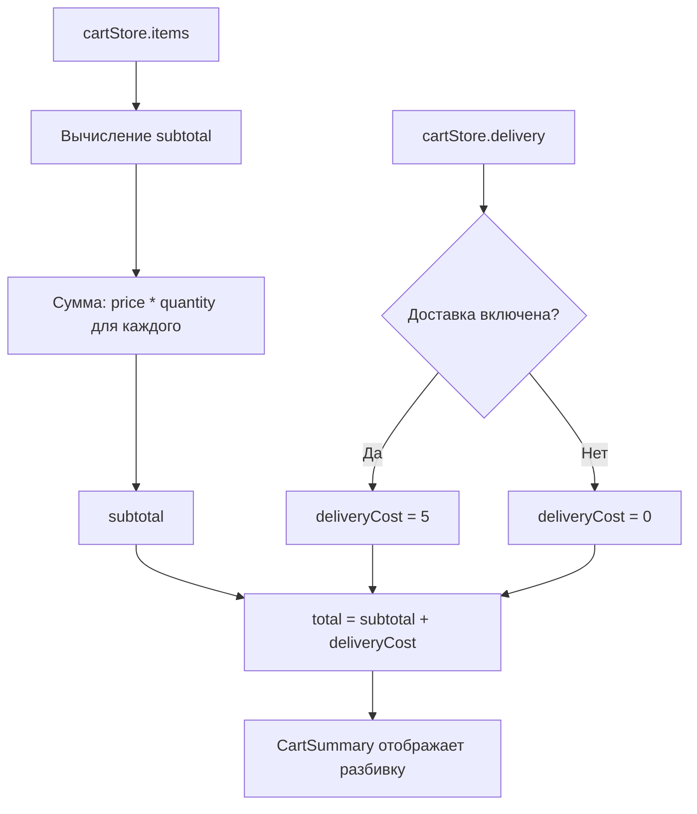
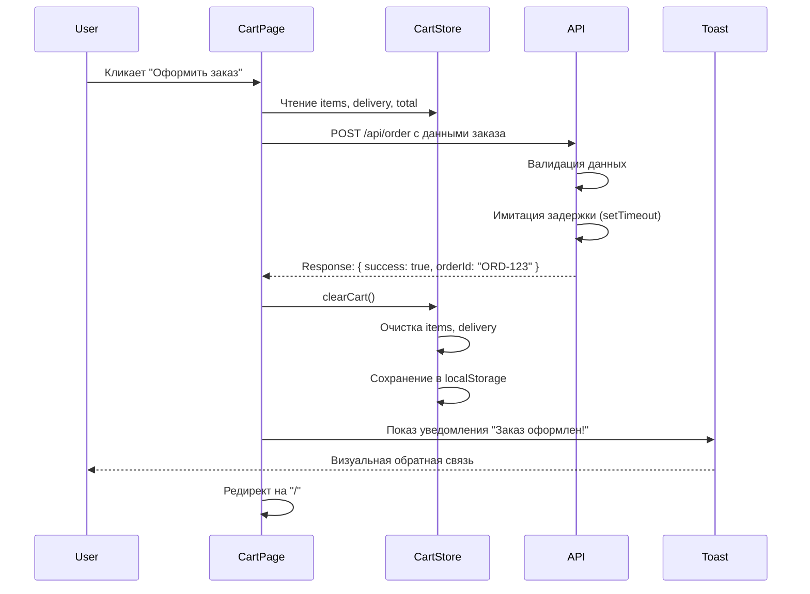
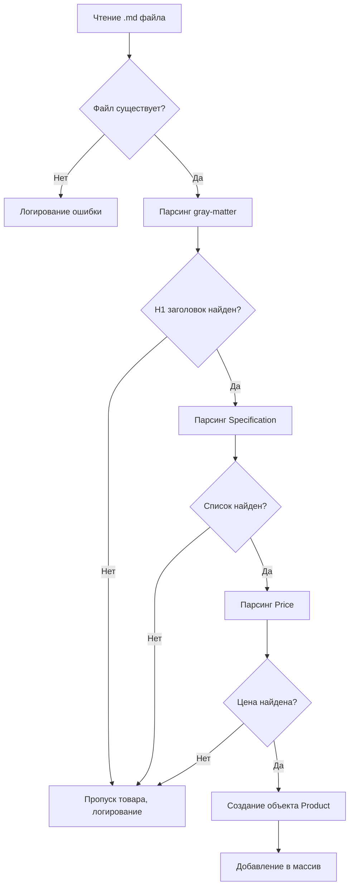
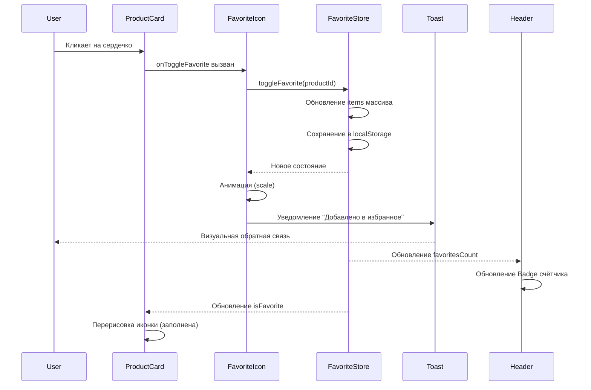
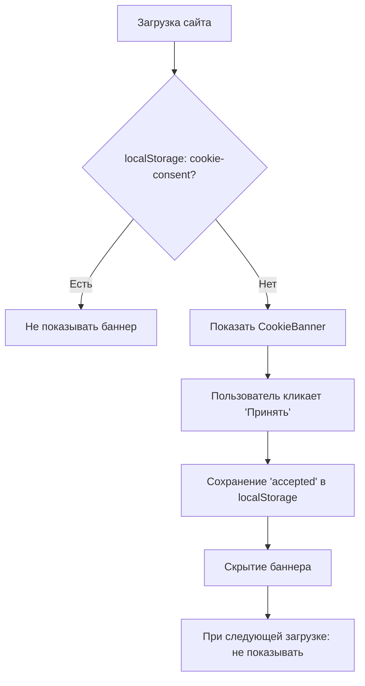

# Потоки данных и логика Pineapple Pi 2.0

## 📊 Схема загрузки данных (Build-time)

```mermaid
graph TD
    A[Markdown файлы в /public/products/specification/] --> B[lib/markdown.ts: parseMarkdownFile]
    B --> C[lib/products.ts: getAllProducts]
    C --> D[Массив объектов Product]
    D --> E[app/page.tsx: Главная страница]
    D --> F[app/product/[id]/page.tsx: generateStaticParams]
    F --> G[Генерация всех /product/[id] страниц]
    D --> H[app/favorites/page.tsx: Фильтрация по избранному]
    
    I[/public/products/images/*.jpg] --> J[next/image: Оптимизация]
    J --> E
    J --> G
```

### Описание потока

**Этап 1: Чтение файлов (Build Time)**
- Функция `getAllProducts()` сканирует директорию `/public/products/specification/`
- Используется `fs.readdirSync` для получения списка файлов
- Каждый `.md` файл обрабатывается через `parseMarkdownFile()`

**Этап 2: Парсинг Markdown**
- `gray-matter` извлекает заголовок H1
- `marked` парсит содержимое в HTML
- Регулярные выражения извлекают секции Specification и Price
- Создаётся объект Product с полями: id, title, specifications, price, priceFormatted, imagePath, shortDescription, slug

**Этап 3: Генерация путей**
- `generateStaticParams()` в `product/[id]/page.tsx` вызывает `getAllProducts()`
- Возвращает массив `{ id: slug }` для каждого товара
- Next.js генерирует статические страницы для всех путей

**Этап 4: Рендеринг страниц**
- Главная страница: получает все товары, передаёт в ProductGrid
- Страница товара: получает id из params, находит товар через `getProductById(id)`
- Страница избранного: фильтрует товары по IDs из favoriteStore

---

## 🛒 Логика работы корзины

### Действия и мутации состояния



### Методы cartStore

#### addItem(productId, quantity)

**Логика:**
1. Проверка: есть ли товар уже в items
2. Если есть: `item.quantity += quantity`
3. Если нет: добавить новый `{ product, quantity }`
4. Триггер пересчёта геттеров
5. Автоматическое сохранение в localStorage

**Валидация:**
- quantity > 0
- product существует

---

#### removeItem(productId)

**Логика:**
1. Фильтрация items: удалить элемент с matching productId
2. Триггер пересчёта геттеров
3. Сохранение в localStorage

---

#### updateQuantity(productId, quantity)

**Логика:**
1. Найти item по productId
2. Если quantity <= 0: вызвать removeItem(productId)
3. Иначе: обновить `item.quantity = quantity`
4. Триггер пересчёта геттеров
5. Сохранение в localStorage

---

#### clearCart()

**Логика:**
1. Очистить items: `[]`
2. Сбросить delivery: `false`
3. Сохранение в localStorage

---

#### toggleDelivery(enabled)

**Логика:**
1. Установить `delivery = enabled`
2. Триггер пересчёта total (геттер)
3. Сохранение в localStorage

---

### Геттеры cartStore

#### totalItems

**Формула:** `items.reduce((sum, item) => sum + item.quantity, 0)`

**Пример:**
- Item 1: quantity=2
- Item 2: quantity=1
- **totalItems = 3**

---

#### subtotal

**Формула:** `items.reduce((sum, item) => sum + (item.product.price * item.quantity), 0)`

**Пример:**
- Item 1: price=$40, quantity=2 → $80
- Item 2: price=$50, quantity=1 → $50
- **subtotal = $130**

---

#### deliveryCost

**Формула:** `delivery ? 5 : 0`

**Пример:**
- delivery=true → **$5**
- delivery=false → **$0**

---

#### total

**Формула:** `subtotal + deliveryCost`

**Пример:**
- subtotal=$130, deliveryCost=$5 → **$135**

---

## ❤️ Логика работы избранного

### Добавление/удаление (toggle)



### Методы favoriteStore

#### toggleFavorite(productId)

**Логика:**
1. Проверка: есть ли productId в items
2. Если есть: удалить из массива (filter)
3. Если нет: добавить в массив (push)
4. Сохранение в localStorage
5. Возврат нового состояния

**Реактивность:**
- Все компоненты, использующие `isFavorite(productId)`, обновляются автоматически
- ProductGrid перерисовывает иконки
- ProductDetails обновляет состояние

---

#### removeFavorite(productId)

**Логика:**
1. Фильтрация items: удалить productId
2. Сохранение в localStorage

---

#### isFavorite(productId)

**Логика:**
1. Проверка: `items.includes(productId)`
2. Возврат boolean

**Использование:**
- ProductCard: определение цвета иконки
- ProductDetails: начальное состояние
- Favorites page: фильтрация товаров

---

#### clearFavorites()

**Логика:**
1. Очистить items: `[]`
2. Сохранение в localStorage

---

### Синхронизация состояния избранного

**Проблема:** Избранное отображается на нескольких страницах (главная, детальная, избранное)

**Решение:**
- Единый источник истины: favoriteStore (Zustand)
- Персистентность в localStorage
- При изменении на одной странице — обновление на всех (через реактивность Zustand)

**Сценарий:**
1. Пользователь на главной странице, кликает сердечко на товаре A
2. favoriteStore обновляется, items = ["PineapplePi-M4Berry"]
3. Пользователь переходит на `/product/PineapplePi-M4Berry`
4. ProductDetails читает `isFavorite("PineapplePi-M4Berry")` → true
5. Иконка отображается заполненной

---

## 💰 Схема расчёта итоговой суммы



### Реактивные вычисления

**Механизм:** Zustand геттеры

**Зависимости:**
- `totalItems` зависит от `items`
- `subtotal` зависит от `items`
- `deliveryCost` зависит от `delivery`
- `total` зависит от `subtotal` и `deliveryCost`

**Обновление:**
- При изменении items или delivery — автоматический пересчёт
- Компоненты, использующие геттеры, получают новые значения

**Пример расчёта:**

| Товар | Цена | Количество | Сумма |
|-------|------|------------|-------|
| PineapplePi-M4Berry | $40 | 2 | $80 |
| PineapplePi-F3 | $50 | 1 | $50 |
| **Сумма товаров** | | | **$130** |
| Доставка | $5 | | $5 |
| **Итого** | | | **$135** |

---

## 📦 Жизненный цикл оформления заказа



### Данные запросы POST /api/order

**Request Body:**
```json
{
  "items": [
    {
      "id": "PineapplePi-M4Berry",
      "title": "Banana Pi BPI-M4 Berry...",
      "price": 40,
      "quantity": 2
    },
    {
      "id": "PineapplePi-F3",
      "title": "Pineapple Pi F3...",
      "price": 50,
      "quantity": 1
    }
  ],
  "delivery": true,
  "subtotal": 130,
  "deliveryCost": 5,
  "total": 135
}
```

**Response:**
```json
{
  "success": true,
  "orderId": "ORD-1712345678901",
  "message": "Заказ успешно оформлен"
}
```

### Обработка ошибок

**Сценарии:**
- Пустая корзина: показать ошибку, не отправлять запрос
- Ошибка API: показать toast "Ошибка оформления, попробуйте снова"
- Таймаут: показать toast "Превышено время ожидания"

---

## 🔔 Интеграция Zustand с Chakra UI (Уведомления)

### Toast уведомления

**Механизм:** Chakra UI `useToast` хук

**Сценарии использования:**

| Сценарий | Тип | Текст |
|----------|-----|-------|
| Добавление в корзину | success | "Товар добавлен в корзину" |
| Удаление из корзины | info | "Товар удалён из корзины" |
| Добавление в избранное | success | "Товар добавлен в избранное" |
| Удаление из избранного | info | "Товар удалён из избранного" |
| Успешная отправка формы | success | "Сообщение отправлено!" |
| Ошибка формы | error | "Ошибка: проверьте поля" |
| Оформление заказа | success | "Заказ оформлен! ID: ORD-..." |
| Ошибка оформления | error | "Ошибка оформления заказа" |

**Настройка toast:**
- duration: 3000 (3 секунды)
- position: "top-right"
- isClosable: true

---

## 📄 Обработка ошибок при парсинге Markdown

### Стратегия



### Типы ошибок

| Ошибка | Причина | Действие |
|--------|---------|----------|
| Файл не читается | Нет доступа, битый файл | Лог в консоль, пропуск |
| Нет H1 заголовка | Неверный формат Markdown | Лог, пропуск |
| Нет секции Specification | Пропущена секция | Лог, пропуск |
| Нет секции Price | Пропущена цена | Лог, пропуск |
| Цена не число | Неверный формат (например, "free") | Лог, пропуск |
| Изображение не найдено | Нет соответствующего .jpg | Использовать placeholder |

### Валидация структуры

**Обязательные поля в Markdown:**
- H1 заголовок (название товара)
- Секция "## Specification" с маркированным списком
- Секция "## Price" с числовым значением ($XX)

**Регулярное выражение для цены:**
- Паттерн: `/\$(\d+)/`
- Пример: "$40" → 40

---

## 💾 Персистентность данных

### localStorage ключи

| Ключ | Данные | Формат |
|------|--------|--------|
| `pineapple-cart` | Корзина | JSON: `{ items: [...], delivery: bool }` |
| `pineapple-favorites` | Избранное | JSON: `["id1", "id2", ...]` |
| `pineapple-cookie-consent` | Cookie согласие | Строка: `"accepted"` |
| `chakra-ui-color-mode` | Выбор темы | Строка: `"light"` / `"dark"` (автоматически Chakra) |

### Zustand persist middleware

**Конфигурация для cartStore:**
```
persist(cartStore, {
  name: "pineapple-cart",
  version: 1,
  migrate: (persistedState, version) => {
    // Миграция при изменении версии
    if (version === 0) {
      // Добавить поле delivery если его нет
      persistedState.delivery = false
    }
    return persistedState
  }
})
```

**Конфигурация для favoriteStore:**
```
persist(favoriteStore, {
  name: "pineapple-favorites",
  version: 1
})
```

### Миграция данных

**Сценарий:** Изменение структуры store в новой версии

**Решение:**
- Увеличить version в persist конфигурации
- Написать migrate функцию
- Проверка persistedState на наличие новых полей
- Значения по умолчанию для отсутствующих полей

**Пример:**
- Версия 0: только items
- Версия 1: добавлено delivery
- Миграция: если нет delivery → установить false

---

## 🔄 Взаимодействие компонентов при работе с избранным

### Сценарий: Добавление в избранное с главной страницы



### Сценарий: Синхронизация между страницами

**Проблема:** Пользователь добавил товар в избранное на главной, перешёл на страницу товара — иконка должна быть заполненной

**Решение:**
- При монтировании ProductDetails: чтение `isFavorite(productId)` из favoriteStore
- Zustand store — синглтон, состояние общее для всего приложения
- Не требуется дополнительная синхронизация

**Поток:**
1. Главная страница: клик сердечка → favoriteStore.items = ["id1"]
2. Переход на `/product/id1`
3. ProductDetails монтируется, читает `isFavorite("id1")` → true
4. Иконка отображается заполненной

---

## 🍪 Жизненный цикл Cookie баннера



### Детали реализации

**Компонент:** CookieBanner (Client Component)

**Состояние:**
- useState: `isVisible` (boolean, по умолчанию false)

**useEffect:**
```
При монтировании:
  1. Проверить localStorage.getItem("pineapple-cookie-consent")
  2. Если нет значения → setIsVisible(true)
  3. Если есть → не показывать
```

**Обработчик принятия:**
```
При клике "Принять":
  1. localStorage.setItem("pineapple-cookie-consent", "accepted")
  2. setIsVisible(false)
  3. Баннер скрывается
```

**Условный рендеринг:**
- isVisible === true → рендерить баннер
- isVisible === false → рендерить null

---

## 📱 Адаптивное поведение компонентов

### Breakpoints и отклик

| Компонент | base (<768px) | md (≥768px) | lg (≥992px) |
|-----------|---------------|-------------|-------------|
| Header | Гамбургер-меню (Drawer) | Гамбургер-меню | Горизонтальная навигация |
| ProductGrid | 1 колонка | 2 колонки | 3-4 колонки |
| ProductDetails | 1 колонка (вертикально) | 1 колонка | 2 колонки (изображение + инфо) |
| CartItem | Вертикальный layout | Вертикальный | Горизонтальный |
| Footer | 1 колонка | 2 колонки | 3 колонки |

### Механизм реализации

**Chakra UI Responsive props:**
- `base={{...}}`, `md={{...}}`, `lg={{...}}`
- SimpleGrid: `columns={{ base: 1, md: 2, lg: 3 }}`
- Flex: `direction={{ base: "column", lg: "row" }}`
- show/hide через `display={{ base: "none", lg: "block" }}`

**Drawer для мобильного меню:**
- Использовать Chakra Drawer компонент
- Trigger: кнопка гамбургера (видна только на base/md)
- Содержимое: вертикальная навигация

---

## ✅ Чек-лист потоков данных

- [x] Схема загрузки данных (build-time парсинг)
- [x] Логика работы корзины (действия, мутации)
- [x] Логика работы избранного (добавление/удаление, синхронизация)
- [x] Схема расчёта итоговой суммы (реактивные вычисления)
- [x] Жизненный цикл оформления заказа
- [x] Интеграция Zustand с Chakra UI (уведомления)
- [x] Обработка ошибок при парсинге Markdown
- [x] Персистентность корзины, избранного, cookie
- [x] Взаимодействие компонентов при работе с избранным
- [x] Адаптивное поведение

---

## 📝 Примечания для реализации

### Приоритет этапов

1. **Настройка проекта:** Chakra UI провайдер, тема, layout
2. **Парсинг данных:** lib/markdown.ts, lib/products.ts
3. **Zustand stores:** cartStore, favoriteStore
4. **Базовые компоненты:** Header, Footer, ProductCard, ProductGrid
5. **Главная страница:** / с каталогом
6. **Страница товара:** /product/[id] с SSG
7. **Избранное:** /favorites + FavoriteIcon
8. **Корзина:** /cart + CartItem, DeliveryOption, CartSummary
9. **API routes:** /api/feedback, /api/order
10. **Дополнительные страницы:** /about, /contact, 404
11. **Cookie баннер:** CookieBanner
12. **Тестирование и полировка:** адаптивность, темизация, уведомления

### Ключевые зависимости

| Пакет | Версия | Назначение |
|-------|--------|------------|
| gray-matter | latest | Парсинг frontmatter |
| marked | latest | Markdown → HTML |
| lucide-react | latest | Иконки (сердечко, корзина) |
| @chakra-ui/react | 3.x | UI компоненты |
| zustand | 5.x | Управление состоянием |
| next/image | built-in | Оптимизация изображений |

### Тестирование

**Рекомендуемые тесты:**
- Парсинг Markdown файлов (unit)
- Zustand stores геттеры и методы (unit)
- ProductCard рендеринг (component)
- Cart логика расчёта суммы (unit)
- API routes валидация (integration)
